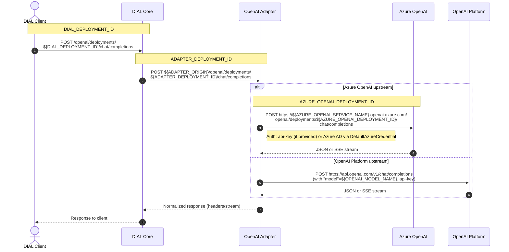

# OpenAI Adapter

## Overview

The project implements [AI DIAL API](https://epam-rail.com/dial_api) for language models from [Azure OpenAI](https://learn.microsoft.com/en-us/azure/ai-services/openai/concepts/models).

## Developer environment

This project uses [Python>=3.11](https://www.python.org/downloads/) and [Poetry>=2.1.1](https://python-poetry.org/) as a dependency manager.

Check out Poetry's [documentation on how to install it](https://python-poetry.org/docs/#installation) on your system before proceeding.

To install requirements:

```sh
poetry install
```

This will install all requirements for running the package, linting, formatting and tests.

### IDE configuration

The recommended IDE is [VSCode](https://code.visualstudio.com/).
Open the project in VSCode and install the recommended extensions.

The VSCode is configured to use PEP-8 compatible formatter [Black](https://black.readthedocs.io/en/stable/index.html).

Alternatively you can use [PyCharm](https://www.jetbrains.com/pycharm/).

Set-up the Black formatter for PyCharm [manually](https://black.readthedocs.io/en/stable/integrations/editors.html#pycharm-intellij-idea) or
install PyCharm>=2023.2 with [built-in Black support](https://blog.jetbrains.com/pycharm/2023/07/2023-2/#black).

## Run

Run the development server locally:

```sh
make serve
```

Run the server from Docker container:

```sh
make docker_serve
```

### Make on Windows

As of now, Windows distributions do not include the make tool. To run make commands, the tool can be installed using
the following command (since [Windows 10](https://learn.microsoft.com/en-us/windows/package-manager/winget/)):

```sh
winget install GnuWin32.Make
```

For convenience, the tool folder can be added to the PATH environment variable as `C:\Program Files (x86)\GnuWin32\bin`.
The command definitions inside Makefile should be cross-platform to keep the development environment setup simple.

## Chat completions deployments

The adapter is able to convert certain upstream APIs to the [DIAL Chat Completions API](https://dialx.ai/dial_api#operation/sendChatCompletionRequest) *(which is an extension of Azure [OpenAI Chat Completions API](https://platform.openai.com/docs/api-reference/chat))*.

Chat Completions deployments are exposed via the endpoint:

```text
POST ${ADAPTER_ORIGIN}/openai/deployments/${ADAPTER_DEPLOYMENT_ID}/chat/completions
```

### Supported upstream chat APIs

#### Azure OpenAI Chat Completions API (Last generation API)

<details><summary>DIAL Core Config</summary>

```json
{
  "models": {
    "${DIAL_DEPLOYMENT_ID}": {
      "type": "chat",
      "endpoint": "${ADAPTER_ORIGIN}/deployments/${ADAPTER_DEPLOYMENT_ID}/chat/completions",
      "upstreams": [
        {
          "endpoint": "https://${AZURE_OPENAI_SERVICE_NAME}.openai.azure.com/openai/deployments/${AZURE_OPENAI_DEPLOYMENT_ID}/chat/completions",
          "key": "${OPTIONAL_API_KEY}"
        }
      ]
    }
  }
}
```

</details>

There are three free variables in the config related to deployment ids.
Each of these variables corresponds to an HTTP request initiated by the DIAL client:

1. `DIAL_DEPLOYMENT_ID` - it's the deployment id visible to the DIAL Client via DIAL deployment listing. The client will be using the id to call the model by sending the request `POST ${DIAL_CORE_ORIGIN}/openai/deployments/${DIAL_DEPLOYMENT_ID}/chat/completions`
2. `ADAPTER_DEPLOYMENT_ID` - the deployment id that the OpenAI adapter will receive when DIAL Core will call `POST ${ADAPTER_ORIGIN}/openai/deployments/${ADAPTER_DEPLOYMENT_ID}/chat/completions`. This identifier is the should be used in environment variables defining [deployment categories](#categories-of-deployments).
3. `AZURE_OPENAI_DEPLOYMENT_ID` - the Azure OpenAI deployment called by the OpenAI adapter.



Typically, these three variables take the same value dictated by the name of the Azure OpenAI deployment. This may not be the case, if you want to create multiple DIAL deployments calling the same Azure OpenAI endpoints, but [configured](#configurable-models) differently.

The [DefaultAzureCredential](https://learn.microsoft.com/en-us/python/api/azure-identity/azure.identity.defaultazurecredential?view=azure-python) is used to authenticate requests to Azure when the api-key is missing from the upstream configuration.

#### Azure OpenAI Chat Completions API (Next generation API)

The Next generation API (aka [v1 API](https://learn.microsoft.com/en-us/azure/ai-foundry/openai/api-version-lifecycle?tabs=key#next-generation-api)) doesn't include the deployment id in the URL:

* Last generation API: `POST https://SERVICE_NAME.openai.azure.com/openai/deployments/gpt-4o/chat/completions`
* Next generation API: `POST https://SERVICE_NAME.openai.azure.com/openai/v1/chat/completions`

The DIAL configuration changes accordingly:

<details><summary>DIAL Core Config</summary>

```json
{
  "models": {
    "${DIAL_DEPLOYMENT_ID}": {
      "type": "chat",
      "overrideName": "${AZURE_OPENAI_DEPLOYMENT_ID}",
      "endpoint": "${ADAPTER_ORIGIN}/deployments/${ADAPTER_DEPLOYMENT_ID}/chat/completions",
      "upstreams": [
        {
          "endpoint": "https://${AZURE_OPENAI_SERVICE_NAME}.openai.azure.com/openai/v1/chat/completions",
          "key": "${OPTIONAL_API_KEY}"
        }
      ],
    }
  }
}
```

</details>

Since the deployment id isn't included in the upstream URL, we specify it the `overrideName` field. If the field is missing, then the model name will take value of `model` field from the original chat completion request if it was present, or `${ADAPTER_DEPLOYMENT_ID}` otherwise.

#### OpenAI Platform [Chat Completions API](https://platform.openai.com/docs/api-reference/chat/create)

<details><summary>DIAL Core Config</summary>

```json
{
  "models": {
    "${DIAL_DEPLOYMENT_ID}": {
      "type": "chat",
      "overrideName": "${OPENAI_MODEL_NAME}",
      "endpoint": "${ADAPTER_ORIGIN}/deployments/${ADAPTER_DEPLOYMENT_ID}/chat/completions",
      "upstreams": [
        {
          "endpoint": "https://api.openai.com/v1/chat/completions",
          "key": "${API_KEY}"
        }
      ],
    }
  }
}
```

</details>

Note the difference from the Azure OpenAI configuration:

* The API key is required.
* Added `overrideName` field that specifies the name of the upstream OpenAI model. The upstream URL doesn't include the model name *(as it was in Azure case)*, so we specify it in the `overrideName` field. If the field is missing, then the model name will take value of `model` field from the original chat completion request if it was present, or `${ADAPTER_DEPLOYMENT_ID}` otherwise.

#### Azure OpenAI Responses API (Next generation API)

Certain advanced features of OpenAI models, such as [reasoning summary](https://platform.openai.com/docs/guides/reasoning#reasoning-summaries), are only accessible via Responses API and not accessible via Chat Completions API.

<details><summary>DIAL Core Config</summary>

```json
{
  "models": {
    "${DIAL_DEPLOYMENT_ID}": {
      "type": "chat",
      "overrideName": "${AZURE_OPENAI_DEPLOYMENT_ID}",
      "endpoint": "${ADAPTER_ORIGIN}/deployments/${ADAPTER_DEPLOYMENT_ID}/chat/completions",
      "upstreams": [
        {
          "endpoint": "https://${AZURE_OPENAI_SERVICE_NAME}.openai.azure.com/openai/v1/responses",
          "key": "${API_KEY}"
        }
      ],
    }
  }
}
```

</details>

As in other cases were the upstream URL is missing deployment id, we specify it in the `overrideName` field.

The last generation API is also supported via an URLs in the following format:

```text
"endpoint": "https://${AZURE_OPENAI_SERVICE_NAME}.openai.azure.com/openai/responses",
```

#### Azure [OpenAI Images API](https://platform.openai.com/docs/api-reference/images/create)

<details><summary>DIAL Core Config</summary>

```json
{
  "models": {
    "${DIAL_DEPLOYMENT_ID}": {
      "type": "chat",
      "endpoint": "${ADAPTER_ORIGIN}/deployments/${ADAPTER_DEPLOYMENT_ID}/chat/completions",
      "upstreams": [
        {
          "endpoint": "https://${AZURE_OPENAI_SERVICE_NAME}.openai.azure.com/openai/deployments/${AZURE_OPENAI_DEPLOYMENT_ID}/images/generations",
          "key": "${OPTIONAL_API_KEY}"
        }
      ],
    }
  }
}
```

</details>

The supported upstream models are `dall-e-3` and `gpt-image-1`. This is the values that`AZURE_OPENAI_DEPLOYMENT_ID` variable could take.

> [!IMPORTANT]
> The DALL·E 3 adapter deployment must be declared in `DALLE3_DEPLOYMENTS` env variable, and GPT-Image 1 deployment - in `GPT_IMAGE_1_DEPLOYMENTS`.

#### OpenAI Completions API

The adapter also supports **legacy** [Completions API](https://platform.openai.com/docs/api-reference/completions/create) both for Azure-style upstream endpoints and OpenAI Platform-style endpoints:

<details><summary>DIAL Core Config</summary>

```json
{
  "models": {
    "${DIAL_DEPLOYMENT_ID}": {
      "type": "chat",
      "overrideName": "${OPENAI_MODEL_NAME}",
      "endpoint": "${ADAPTER_ORIGIN}/deployments/${ADAPTER_DEPLOYMENT_ID}/chat/completions",
      "upstreams": [
        {
          "endpoint": "https://api.openai.com/v1/completions",
          "key": "${API_KEY}"
        }
      ],
    }
  }
}
```

</details>

### Tokenization of chat completion requests/responses

One of the promises that the adapter makes is that all chat completions responses from the adapter will contain information about token usage *(that is consumed prompt tokens and completion tokens)*.

However, by default neither Azure OpenAI, nor OpenAI Platform returns token usage for streaming requests *(that is those with `stream` field set to `True`)*.

Therefore, the adapter has to tokenize both request and response when the upstream doesn't provide the usage. Moreover, the tokenization on the adapter side is required when the request has `max_prompt_tokens` field. This field tells to how many tokens the incoming request must be truncated to before being sent to the upstream.

#### How to minimize adapter-side tokenization

The tokenization algorithm is CPU heavy and therefore may throttle requests under high load. Therefore, it's important to minimize the cases when the tokenization is required.

Azure OpenAI and OpenAI Platform return token usage for streaming request when [include_usage](https://platform.openai.com/docs/api-reference/chat/create#chat-create-stream_options) option is enabled in the chat completion request. We recommend to reset this option in the DIAL Core configuration via `defaults` field. This will decrease adapter's CPU usage.

```json
{
  "models": {
    "${DIAL_DEPLOYMENT_ID}": {
      "type": "chat",
      "endpoint": "...",
      "upstreams": ["..."],
      "defaults": {
        "stream_options": {
          "include_usage": true
        }
      }
    }
  }
}
```

#### Tokenization algorithm

How does the adapter know which deployment has which tokenization algorithm?

The adapter doesn't do tokenization for:

1. deployments registered in `DATABRICKS_DEPLOYMENTS` and `MISTRAL_DEPLOYMENTS` env vars. It's expected upstream for these deployments are going to return the token usage.
2. deployments supported by the following APIs:
   1. legacy Completions API
   2. Images API
   3. Responses API

For the rest of the deployments, the tokenization is determined in the following way.

> [!IMPORTANT]
> Adapter-side tokenization of documents, audio and video files aren't currently supported in the adapter. Such multi-modal content is evaluated to zero tokens.

##### Text tokenization

The adapter is using the [tiktoken](https://github.com/openai/tiktoken) library as a tokenizer for OpenAI models.

`TIKTOKEN_MODEL_MAPPING` env variable defines a mapping from adapter deployment ids to the model identifies which are know to [tiktoken](https://github.com/openai/tiktoken/blob/main/tiktoken/model.py).

If the adapter deployment id could not be resolved by `tiktoken`, then the adapter throws an internal server error explaining the issue.

##### Image tokenization

If deployment is registered in `GPT4O_DEPLOYMENTS` or in `GPT4O_MINI_DEPLOYMENTS`, then a corresponding image tokenization algorithm is used described in [the Azure documentation](https://learn.microsoft.com/en-us/azure/ai-foundry/openai/overview#image-input-tokens).

Otherwise, images aren't tokenized - the image tokens are assumed to be equal to 0.

## Embedding deployments

The adapter is able to convert certain upstream APIs to the [DIAL Embeddings API](https://dialx.ai/dial_api#operation/sendEmbeddingsRequest) *(which is an extension of Azure [OpenAI Embeddings API](https://platform.openai.com/docs/api-reference/embeddings/create))*.

Embeddings deployments are exposed via the endpoint:

```text
POST ${ADAPTER_ORIGIN}/openai/deployments/${ADAPTER_DEPLOYMENT_ID}/embeddings
```

### Supported upstream embedding APIs

#### Azure OpenAI Embeddings API (Last generation API)

<details><summary>DIAL Core Config</summary>

```json
{
  "models": {
    "${DIAL_DEPLOYMENT_ID}": {
      "type": "embedding",
      "endpoint": "${ADAPTER_ORIGIN}/deployments/${ADAPTER_DEPLOYMENT_ID}/embeddings",
      "upstreams": [
        {
          "endpoint": "https://${AZURE_OPENAI_SERVICE_NAME}.openai.azure.com/openai/deployments/${AZURE_OPENAI_DEPLOYMENT_ID}/embeddings",
          "key": "${OPTIONAL_API_KEY}"
        }
      ]
    }
  }
}
```

</details>

#### Azure OpenAI Embeddings API (Next generation API)

<details><summary>DIAL Core Config</summary>

```json
{
  "models": {
    "${DIAL_DEPLOYMENT_ID}": {
      "type": "embedding",
      "overrideName": "${AZURE_OPENAI_DEPLOYMENT_ID}",
      "endpoint": "${ADAPTER_ORIGIN}/deployments/${ADAPTER_DEPLOYMENT_ID}/embeddings",
      "upstreams": [
        {
          "endpoint": "https://${AZURE_OPENAI_SERVICE_NAME}.openai.azure.com/openai/v1/embeddings",
          "key": "${OPTIONAL_API_KEY}"
        }
      ]
    }
  }
}
```

</details>

#### OpenAI Platform [Embeddings API](https://platform.openai.com/docs/api-reference/embeddings/create)

<details><summary>DIAL Core Config</summary>

```json
{
  "models": {
    "${DIAL_DEPLOYMENT_ID}": {
      "type": "chat",
      "overrideName": "${OPENAI_MODEL_NAME}",
      "endpoint": "${ADAPTER_ORIGIN}/deployments/${ADAPTER_DEPLOYMENT_ID}/chat/completions",
      "upstreams": [
        {
          "endpoint": "https://api.openai.com/v1/embeddings",
          "key": "${API_KEY}"
        }
      ],
    }
  }
}
```

</details>

#### Azure multimodal embeddings

The adapter supports [Azure Multimodal embeddings](https://learn.microsoft.com/en-us/azure/ai-services/computer-vision/concept-image-retrieval).

<details><summary>DIAL Core Config</summary>

```json
{
  "models": {
    "${DIAL_DEPLOYMENT_ID}": {
      "type": "embedding",
      "endpoint": "${ADAPTER_ORIGIN}/deployments/${ADAPTER_DEPLOYMENT_ID}/chat/completions",
      "upstreams": [
        {
          "endpoint": "https://${COMPUTER_VISION_SERVICE_NAME}.cognitiveservices.azure.com",
          "key": "${OPTIONAL_API_KEY}"
        }
      ]
    }
  }
}
```

</details>

> [!IMPORTANT]
> `${ADAPTER_DEPLOYMENT_ID}` must be added to the env variable `AZURE_AI_VISION_DEPLOYMENTS` to enable the embeddings deployment.

The multimodal embeddings model supports text and images as inputs.

Since the original OpenAI embeddings API only support text inputs, the image inputs should be passed in the `custom_input` request field as URL or in base64-encoded format:

```sh
curl -X POST "${DIAL_CORE_ORIGIN}/deployments/${DIAL_DEPLOYMENT_ID}/embeddings" -v \
  -H "api-key:${DIAL_API_KEY}" \
  -H "content-type:application/json" \
  -d '{"input": ["cat", "fish"], "custom_input": [{"type": "image/png", "url": "https://learn.microsoft.com/azure/ai-services/computer-vision/media/quickstarts/presentation.png"}]}'
```

The response will contain three embedding vectors, each corresponding to one of the inputs in the original request.

## Environment Variables

Copy `.env.example` to `.env` and customize it for your environment.

### Categories of deployments

The following variables cluster all deployments into the groups of deployments which share the same API and the same tokenization algorithm.

|Variable|Default|Description|
|---|---|---|
|DALLE3_DEPLOYMENTS|``|Comma-separated list of deployments that support DALL-E 3 API. Example: `dall-e-3,dalle3,dall-e`|
|DALLE3_AZURE_API_VERSION|2024-02-01|The version API for requests to Azure DALL-E-3 API|
|GPT_IMAGE_1_DEPLOYMENTS|``|Comma-separated list of deployments that support GPT-Image 1 API. Example: `gpt-image-1`|
|GPT_IMAGE_1_AZURE_API_VERSION|2024-02-01|The version API for requests to Azure GPT Image 1 API|
|MISTRAL_DEPLOYMENTS|``|Comma-separated list of deployments that support Mistral Large Azure API. Example: `mistral-large-azure,mistral-large`|
|DATABRICKS_DEPLOYMENTS|``|Comma-separated list of Databricks chat completion deployments. Example: `databricks-dbrx-instruct,databricks-mixtral-8x7b-instruct,databricks-llama-2-70b-chat`|
|GPT4O_DEPLOYMENTS|``|Comma-separated list of GPT-4o chat completion deployments. Example: `gpt-4o-2024-05-13`|
|GPT4O_MINI_DEPLOYMENTS|``|Comma-separated list of GPT-4o mini chat completion deployments. Example: `gpt-4o-mini-2024-07-18`|
|AZURE_AI_VISION_DEPLOYMENTS|``|Comma-separated list of Azure AI Vision embedding deployments. The endpoint of the deployment is expected point to the Azure service: `https://<service-name>.cognitiveservices.azure.com/`|

Deployments that do not fall into any of the categories are considered to support text-to-text chat completion OpenAI API or text embeddings OpenAI API.

### Other variables

|Variable|Default|Description|
|---|---|---|
|LOG_LEVEL|INFO|Log level. Use DEBUG for dev purposes and INFO in prod|
|WEB_CONCURRENCY|1|Number of workers for the server|
|TIKTOKEN_MODEL_MAPPING|`{}`|Mapping from the request deployment id to [tiktoken model name](https://github.com/openai/tiktoken/blob/main/tiktoken/model.py). Required for the tokenization of chat completion requests/responses on the adapter side when the upstream model doesn't return the token usage. Example: `{"my-gpt-deployment":"gpt-3.5-turbo","my-gpt-o3-deployment":"o3"}`. You don't need to add a deployment to the mapping if it's already named so that it matches one of the `tiktoken` models. You can check it by running `python -c "from tiktoken.model import encoding_name_for_model as e; print(e('my-deployment-name'))"`. All chat completion models require [tokenization](#tokenization-of-chat-completion-requestsresponses) via tiktoken except the one declared in `DATABRICKS_DEPLOYMENTS`, `MISTRAL_DEPLOYMENTS`, GPT_IMAGE_1_DEPLOYMENTS, and `DALLE3_DEPLOYMENTS` variables.|
|DIAL_USE_FILE_STORAGE|False|Save image model artifacts to DIAL File storage (DALL-E images are uploaded to the DIAL file storage and its base64 encodings are replaced with links to the storage)|
|DIAL_URL||URL of the core DIAL server (required when `DIAL_USE_FILE_STORAGE=True`)|
|NON_STREAMING_DEPLOYMENTS|``|Comma-separated list of deployments which do not support streaming. The adapter is going to emulate the streaming by calling the model and converting its response into a single-chunk stream. Example: `"o1-mini,o1-preview"`|
|ACCESS_TOKEN_EXPIRATION_WINDOW|10|The Azure access token is renewed this many seconds before its actual expiration time. The buffer ensures that the token does not expire in the middle of an operation due to processing time and potential network delays.|
|AZURE_OPEN_AI_SCOPE||Provided scope of access token to Azure OpenAI services. Default: `https://cognitiveservices.azure.com/.default`|
|API_VERSIONS_MAPPING|`{}`|The mapping of versions API for requests to Azure OpenAI API. Example: `{"2023-03-15-preview": "2023-05-15", "": "2024-02-15-preview"}`. An empty key sets the default api version for the case when the user didn't pass it in the request|
|ELIMINATE_EMPTY_CHOICES|False|When enabled, the response stream is guaranteed to exclude chunks with an empty list of choices. This is useful when a DIAL client doesn't support such chunks. An empty list of choices can be generated by Azure OpenAI in at least two cases: (1) when the **Content filter** is not disabled, Azure includes [prompt filter results](https://learn.microsoft.com/en-us/azure/ai-services/openai/concepts/content-filter?tabs=warning%2Cuser-prompt%2Cpython-new#prompt-annotation-message) in the first chunk with an empty list of choices; (2) when `stream_options.include_usage` is enabled, the last chunk contains usage data and an empty list of choices.|

## Configurable models

Certain models support configuration via the `$ADAPTER_ORIGIN/openai/deployments/$DEPLOYMENT_NAME/configuration` endpoint.

GET request to this endpoint returns the schema of the model configuration in [JSON Schema](https://json-schema.org/) format.

Such models expect that `custom_fields.configuration` field of the `chat/completions` request will contain a JSON value that conforms to the schema.
The `custom_fields.configuration` field is optional iff. each field in the schema is optional too.

The configuration could be preset in the DIAL Core config via the `defaults` parameter:

<details><summary>DIAL Core Config</summary>

```json
{
  "models": {
    "my-deployment-id": {
      "type": "chat",
      "endpoint": "$ADAPTER_ORIGIN/openai/deployments/my-deployment-id/chat/completions",
      "upstreams": [
        {
          "endpoint": "$AZURE_OPENAI_SERVICE_ORIGIN/openai/deployments/openai-deployment-id/chat/completions"
        }
      ],
      "defaults": {
        "custom_fields": {
            "configuration": $MODEL_CONFIGURATION_OBJECT
        }
      }
    }
  }
}
```

</details>

This could be convenient if certain major features of a model could be enabled via the configuration *(e.g. web search or reasoning)* and you want to create a deployment where these features are permanently enabled.

DIAL Core will enrich the request with the configuration specified in the `defaults` field, so that the DIAL client doesn't have to provide the configuration enabling the features with each chat completion request.

### DALL-E / GPT Image 1

OpenAI image generation models accept configurations with parameters specific for image generation such as image size, style, and quality.

The latest supported parameters could be found in the official OpenAI documentation for models capable of [image generation](https://platform.openai.com/docs/api-reference/images/create) or in the Azure OpenAI [API documentation](https://learn.microsoft.com/en-us/azure/ai-services/openai/reference#image-generation).

Alternatively, the configuration schema could be retrieved programmatically from the `/configuration` endpoint. However, keep in mind, that this schema could lag behind the official latest one. More on that in the [Forward compatibility](#forward-compatibility) section.

An example of DALL-E 3 request with configured style and image size:

<details><summary>Request</summary>

```json
{
  "model": "dall-e-3",
  "messages": [
    {
      "role": "user",
      "content": "forest meadow"
    }
  ],
  "custom_fields": {
    "configuration": {
      "size": "1024x1024",
      "style": "vivid"
    }
  }
}
```

</details>

Similarly, the configuration could be preset on the per-deployment basis in the DIAL Core config:

<details><summary>DIAL Core Config</summary>

```json
{
  "models": {
    "dial-dall-e-3": {
      "type": "chat",
      "description": "...",
      "endpoint": "...",
      "defaults": {
        "custom_fields": {
          "configuration": {
            "size": "1024x1024",
            "style": "vivid"
          }
        }
      }
    }
  }
}
```

</details>

So that the end user doesn't have to attach configuration to each chat completion request. It will be applied automatically *(if missing)* by the DIAL Core for all incoming requests to this deployment.

#### Forward compatibility

The configuration schema in the adapter isn't fixed and allows for extra fields and arbitrary parameter values. This enables forward compatibility with the future versions of the image generation API.

Let's say the next version of GPT Image model introduces support of a negative prompt *(which isn't currently supported)*. It still will be possible to use a version of OpenAI adapter that is ignorant of the latest developments in the GPT Image API thanks to the permissive configuration schema.

<details><summary>Request</summary>

```json
{
  "model": "gpt-image-1",
  "messages": [
    {
      "role": "user",
      "content": "forest meadow"
    }
  ],
  "custom_fields": {
    "configuration": {
      "negative_prompt": "trees"
    }
  }
}
```

</details>

### Models based on Responses API

The [Responses API](https://platform.openai.com/docs/api-reference/responses) provides more features than [Chat Completions API](https://platform.openai.com/docs/api-reference/chat/create). Some of these features could be enabled via a configuration fields in the chat completions request.

The JSON schema of the configuration is open which enables forward compatibility with the future developments in the Responses API.

> [!NOTE]
> Such a configuration is only possible for the models that are configured in the DIAL Core config to use Responses API upstream endpoints.

#### Reasoning configuration

The [reasoning](https://platform.openai.com/docs/guides/reasoning) and the [reasoning summary](https://platform.openai.com/docs/guides/reasoning#reasoning-summaries) could be enabled via the configuration like this one:

<details><summary>Request</summary>

```json
{
  "model": "gpt-5-2025-08-07",
  "messages": [
    {
      "role": "user",
      "content": "Write a bash script that takes a matrix represented as a string with format \"[1,2],[3,4],[5,6]\" and prints the transpose in the same format."
    }
  ],
  "custom_fields": {
    "configuration": {
      "reasoning": {
        "effort": "medium",
        "summary": "auto"
      }
    }
  }
}
```

</details>

Here `custom_fields.configuration.reasoning` is an object which is being passed to the Response API as the [reasoning](https://platform.openai.com/docs/api-reference/responses/create#responses_create-reasoning) parameter.

> [!important]
> Not all models support reasoning. Consult with the [documentation](https://learn.microsoft.com/en-us/azure/ai-foundry/openai/how-to/reasoning?tabs=gpt-5%2Cpython-secure%2Cpy) before enabling reasoning.

## Load balancing

The adapter supports multiple upstream definitions in the DIAL Core config:

```json
{
    "models": {
        "gpt-4o-2024-11-20": {
            "type": "chat",
            "endpoint": "http://$OPENAI_ADAPTER_ORIGIN/openai/deployments/gpt-4o-2024-11-20/chat/completions",
            "displayName": "GPT-4o",
            "upstreams": [
                {
                    "endpoint": "https://$AZURE_OPENAI_SERVICE_NAME1.openai.azure.com/openai/deployments/gpt-4o-2024-11-20/chat/completions"
                },
                {
                    "endpoint": "https://$AZURE_OPENAI_SERVICE_NAME2.openai.azure.com/openai/deployments/gpt-4o-2024-11-20/chat/completions"
                },
                {
                    "endpoint": "https://$AZURE_OPENAI_SERVICE_NAME3.openai.azure.com/openai/deployments/gpt-4o-2024-11-20/chat/completions"
                }
            ]
        }
    }
}
```

## Prompt caching

The [prompt caching](https://learn.microsoft.com/en-us/azure/ai-services/openai/how-to/prompt-caching) could be enabled via the `autoCachingSupported` flag in the DIAL Core config.

```json
{
    "models": {
        "gpt-4o-2024-11-20": {
            "type": "chat",
            "endpoint": "http://$OPENAI_ADAPTER_ORIGIN/openai/deployments/gpt-4o-2024-11-20/chat/completions",
            "displayName": "GPT-4o",
            "upstreams": [
                {
                    "endpoint": "https://$AZURE_OPENAI_SERVICE_NAME1.openai.azure.com/openai/deployments/gpt-4o-2024-11-20/chat/completions"
                },
                {
                    "endpoint": "https://$AZURE_OPENAI_SERVICE_NAME2.openai.azure.com/openai/deployments/gpt-4o-2024-11-20/chat/completions"
                },
                {
                    "endpoint": "https://$AZURE_OPENAI_SERVICE_NAME3.openai.azure.com/openai/deployments/gpt-4o-2024-11-20/chat/completions"
                }
            ],
            "features": {
                "autoCachingSupported": true
            }
        }
    }
}
```

> [!IMPORTANT]
> Check that the deployment does actually support [prompt caching](https://learn.microsoft.com/en-us/azure/ai-services/openai/how-to/prompt-caching#supported-models) before enabling it in the config.

## Lint

Run the linting before committing:

```sh
make lint
```

To auto-fix formatting issues run:

```sh
make format
```

## Test

Run unit tests locally:

```sh
make test
```

## Clean

To remove the virtual environment and build artifacts:

```sh
make clean
```
