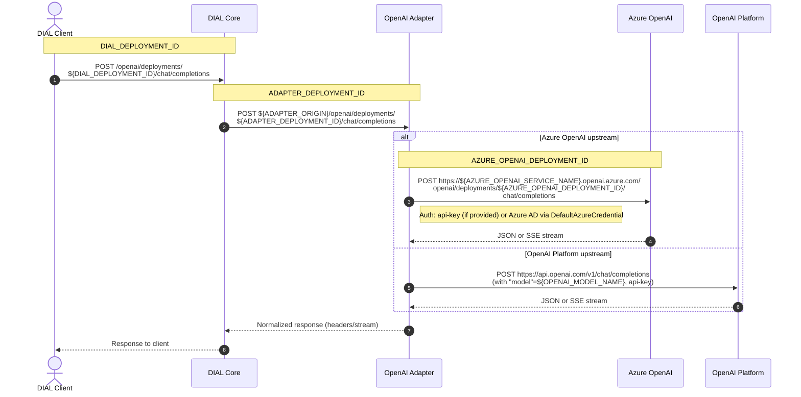

<h1 align="center">
  DIAL OpenAI Adapter
</h1>
<p align="center">
  <p align="center">
  <a href="https://dialx.ai/">
    
  </a>
</p>
<h4 align="center">
  <a href="https://discord.gg/ukzj9U9tEe">
    
  </a>
</h4>

- [Overview](#overview)
- [Chat Completions API deployments](#chat-completions-api-deployments)
  - [Supported upstream chat APIs](#supported-upstream-chat-apis)
    - [Azure OpenAI Chat Completions API (Last generation API)](#azure-openai-chat-completions-api-last-generation-api)
    - [Azure OpenAI Chat Completions API (Next generation API)](#azure-openai-chat-completions-api-next-generation-api)
    - [Azure OpenAI Responses API (Next generation API)](#azure-openai-responses-api-next-generation-api)
      - [Web Search Tool](#web-search-tool)
    - [Azure AI Foundry Chat Completions API](#azure-ai-foundry-chat-completions-api)
    - [Azure OpenAI Images API](#azure-openai-images-api)
    - [Azure OpenAI Video API (Sora 1 API)](#azure-openai-video-api-sora-1-api)
    - [Azure OpenAI Sora 2 API](#azure-openai-sora-2-api)
    - [Azure Audio API](#azure-audio-api)
      - [Text-to-speech models (TTS)](#text-to-speech-models-tts)
      - [Speech-to-text models (STT)](#speech-to-text-models-stt)
    - [OpenAI Platform Chat Completions API](#openai-platform-chat-completions-api)
    - [Amazon Bedrock OpenAI Chat Completions API](#amazon-bedrock-openai-chat-completions-api)
    - [OpenAI Completions API](#openai-completions-api)
    - [Mistral Chat Completion API](#mistral-chat-completion-api)
    - [Alibaba Cloud Model Studio Chat Completions API](#alibaba-cloud-model-studio-chat-completions-api)
    - [vLLM Chat Completion API](#vllm-chat-completion-api)
      - [Qwen3-ASR](#qwen3-asr)
    - [Anthropic Messages API](#anthropic-messages-api)
      - [Default `max_tokens` for Claude models](#default-max_tokens-for-claude-models)
      - [Automatic prompt caching](#automatic-prompt-caching)
      - [Explicit prompt caching](#explicit-prompt-caching)
  - [Anthropic API Passthrough](#anthropic-api-passthrough)
    - [Using Claude Code with the adapter](#using-claude-code-with-the-adapter)
  - [Tokenization of chat completion requests/responses](#tokenization-of-chat-completion-requestsresponses)
    - [How to minimize adapter-side tokenization](#how-to-minimize-adapter-side-tokenization)
    - [Tokenization algorithm](#tokenization-algorithm)
      - [Text tokenization](#text-tokenization)
      - [Image tokenization](#image-tokenization)
      - [vLLM tokenization](#vllm-tokenization)
    - [Tokenize endpoint](#tokenize-endpoint)
      - [DIAL Core configuration](#dial-core-configuration)
    - [Truncate prompt endpoint](#truncate-prompt-endpoint)
      - [DIAL Core configuration](#dial-core-configuration-1)
- [Responses API deployments](#responses-api-deployments)
  - [Supported upstream Responses APIs](#supported-upstream-responses-apis)
    - [Azure OpenAI Responses API](#azure-openai-responses-api)
    - [OpenAI Platform Responses API](#openai-platform-responses-api)
    - [Amazon Bedrock OpenAI Responses API](#amazon-bedrock-openai-responses-api)
    - [Alibaba Cloud Model Studio Responses API](#alibaba-cloud-model-studio-responses-api)
- [Embedding deployments](#embedding-deployments)
  - [Supported upstream embedding APIs](#supported-upstream-embedding-apis)
    - [Azure OpenAI Embeddings API (Last generation API)](#azure-openai-embeddings-api-last-generation-api)
    - [Azure OpenAI Embeddings API (Next generation API)](#azure-openai-embeddings-api-next-generation-api)
    - [Azure multimodal embeddings](#azure-multimodal-embeddings)
    - [OpenAI Platform Embeddings API](#openai-platform-embeddings-api)
    - [vLLM Embeddings API](#vllm-embeddings-api)
- [Environment Variables](#environment-variables)
  - [Categories of deployments](#categories-of-deployments)
  - [Other variables](#other-variables)
- [Configurable models](#configurable-models)
  - [DALL-E / GPT Image 1](#dall-e--gpt-image-1)
    - [Forward compatibility](#forward-compatibility)
  - [Models based on Responses API](#models-based-on-responses-api)
    - [Reasoning configuration](#reasoning-configuration)
- [Load balancing](#load-balancing)
- [Upstream header proxying](#upstream-header-proxying)
- [Prompt caching](#prompt-caching)
- [API versioning](#api-versioning)
- [Server performance configuration](#server-performance-configuration)
- [Deployment](#deployment)
  - [Private CAs and self-signed certificates](#private-cas-and-self-signed-certificates)
    - [Docker](#docker)
- [Development](#development)
  - [Development Environment](#development-environment)
  - [Setup](#setup)
  - [IDE configuration](#ide-configuration)
  - [Make on Windows](#make-on-windows)
  - [Run](#run)
  - [Lint](#lint)
  - [Test](#test)
  - [Clean](#clean)
  - [Git hooks](#git-hooks)

---

## Overview

LLM Adapters unify the APIs of respective LLMs to align with the Unified Protocol of DIAL Core. Each Adapter operates within a dedicated container. Multi-modality allows supporting non-textual communications such as image-to-text, text-to-image, file transfers and more.

The project implements [AI DIAL API](https://dialx.ai/dial_api) for language models from [Azure OpenAI](https://learn.microsoft.com/en-us/azure/ai-services/openai/concepts/models).

---

## Chat Completions API deployments

The adapter is able to convert certain upstream APIs to the [DIAL Chat Completions API](https://dialx.ai/dial_api#operation/sendChatCompletionRequest) *(which is an extension of Azure [OpenAI Chat Completions API](https://platform.openai.com/docs/api-reference/chat))*.

Chat Completions deployments are exposed via the endpoint:

```text
POST ${ADAPTER_ORIGIN}/openai/deployments/${ADAPTER_DEPLOYMENT_ID}/chat/completions
```

### Supported upstream chat APIs

#### Azure OpenAI Chat Completions API (Last generation API)

<details><summary>DIAL Core Config</summary>

```json
{
  "models": {
    "${DIAL_DEPLOYMENT_ID}": {
      "type": "chat",
      "endpoint": "${ADAPTER_ORIGIN}/openai/deployments/${ADAPTER_DEPLOYMENT_ID}/chat/completions",
      "upstreams": [
        {
          "endpoint": "https://${AZURE_OPENAI_SERVICE_NAME}.openai.azure.com/openai/deployments/${AZURE_OPENAI_DEPLOYMENT_ID}/chat/completions",
          "key": "${OPTIONAL_API_KEY}"
        }
      ]
    }
  }
}
```

</details>

There are three free variables in the config related to deployment ids.
Each of these variables corresponds to an HTTP request initiated by the DIAL client:

1. `DIAL_DEPLOYMENT_ID` - it's the deployment id visible to the DIAL Client via DIAL deployment listing. The client will be using the id to call the model by sending the request `POST ${DIAL_CORE_ORIGIN}/openai/deployments/${DIAL_DEPLOYMENT_ID}/chat/completions`
2. `ADAPTER_DEPLOYMENT_ID` - the deployment id the OpenAI adapter receives when DIAL Core calls `POST ${ADAPTER_ORIGIN}/openai/deployments/${ADAPTER_DEPLOYMENT_ID}/chat/completions`. Use this identifier in environment variables that define [deployment categories](#categories-of-deployments).
3. `AZURE_OPENAI_DEPLOYMENT_ID` - the Azure OpenAI deployment called by the OpenAI adapter.



Typically these three variables share the same value (the Azure OpenAI deployment name). They may differ if you expose multiple DIAL deployments that call the same Azure OpenAI endpoint but [configured](#configurable-models) differently.

The [DefaultAzureCredential](https://learn.microsoft.com/en-us/python/api/azure-identity/azure.identity.defaultazurecredential?view=azure-python) is used to authenticate requests to Azure when an API key is not provided in the upstream configuration.

#### Azure OpenAI Chat Completions API (Next generation API)

The Next generation API (aka [v1 API](https://learn.microsoft.com/en-us/azure/ai-foundry/openai/api-version-lifecycle?tabs=key#next-generation-api)) doesn't include the deployment id in the URL:

- Last generation API: `POST https://SERVICE_NAME.openai.azure.com/openai/deployments/gpt-4o/chat/completions`
- Next generation API: `POST https://SERVICE_NAME.openai.azure.com/openai/v1/chat/completions`

The DIAL configuration changes accordingly:

<details><summary>DIAL Core Config</summary>

```json
{
  "models": {
    "${DIAL_DEPLOYMENT_ID}": {
      "type": "chat",
      "overrideName": "${AZURE_OPENAI_DEPLOYMENT_ID}",
      "endpoint": "${ADAPTER_ORIGIN}/openai/deployments/${ADAPTER_DEPLOYMENT_ID}/chat/completions",
      "upstreams": [
        {
          "endpoint": "https://${AZURE_OPENAI_SERVICE_NAME}.openai.azure.com/openai/v1/chat/completions",
          "key": "${OPTIONAL_API_KEY}"
        }
      ]
    }
  }
}
```

</details>

Because the deployment ID is not included in the upstream URL, specify it in the `overrideName` field. If this field is missing, the model name takes the value of the `model` field from the original chat completion request (if present), otherwise `${ADAPTER_DEPLOYMENT_ID}`.

#### Azure OpenAI Responses API (Next generation API)

Certain advanced features of OpenAI models, such as [reasoning summary](https://platform.openai.com/docs/guides/reasoning#reasoning-summaries), are only accessible via Responses API and not accessible via Chat Completions API.

<details><summary>DIAL Core Config</summary>

```json
{
  "models": {
    "${DIAL_DEPLOYMENT_ID}": {
      "type": "chat",
      "overrideName": "${AZURE_OPENAI_DEPLOYMENT_ID}",
      "endpoint": "${ADAPTER_ORIGIN}/openai/deployments/${ADAPTER_DEPLOYMENT_ID}/chat/completions",
      "upstreams": [
        {
          "endpoint": "https://${AZURE_OPENAI_SERVICE_NAME}.openai.azure.com/openai/v1/responses",
          "key": "${API_KEY}"
        }
      ]
    }
  }
}
```

</details>

As in other cases where the upstream URL omits a deployment id, specify it in the `overrideName` field.

The last generation API is also supported via an URLs in the following format:

```text
"endpoint": "https://${AZURE_OPENAI_SERVICE_NAME}.openai.azure.com/openai/responses"
```

##### Web Search Tool

The deployments backed by Azure OpenAI Responses API support the [Web Search tool](https://developers.openai.com/api/docs/guides/tools-web-search), which could be enabled by passing a static function called `web_search` as one of the tools:

<details>
<summary>Example request</summary>

```json
{
  "model": "upstream-model-name",
  "messages": [
    {
      "role": "user",
      "content": "What is the weather in Kyiv now? Include source links."
    }
  ],
  "tools": [
    {
      "type": "static_function",
      "static_function": {
        "name": "web_search",
        "configuration": {
          "search_context_size": "high"
        }
      }
    }
  ],
  "stream": true
}
```
</details>

Each Web Search tool calls are translated into a DIAL stages, and URL citations are mirrored as DIAL attachments:

<details>
<summary>Example response:</summary>

```json
{
  "choices": [
    {
      "message": {
        "content": "Kyiv weather is mild.",
        "custom_content": {
          "stages": [
            {
              "name": "Web Search",
              "status": "completed",
              "content": "Search 'weather Kyiv'"
            }
          ],
          "attachments": [
            {
              "type": "text/markdown",
              "title": "Kyiv weather source",
              "url": "https://example.com/weather/kyiv"
            }
          ]
        }
      }
    }
  ]
}
```
</details>

#### Azure AI Foundry Chat Completions API

Certain LLM models like `gpt-oss-120b` or `Mistral-Large-2411` can only be deployed to an Azure AI Foundry service. They are accessible via:

- Azure AI model inference endpoint or
- Azure OpenAI endpoint

<details><summary>DIAL Core Config (Azure AI model inference endpoint)</summary>

```json
{
  "models": {
    "${DIAL_DEPLOYMENT_ID}": {
      "type": "chat",
      "overrideName": "${AZURE_AI_FOUNDRY_DEPLOYMENT_ID}",
      "endpoint": "${ADAPTER_ORIGIN}/openai/deployments/${ADAPTER_DEPLOYMENT_ID}/chat/completions",
      "upstreams": [
        {
          "endpoint": "https://${AZURE_AI_FOUNDRY_SERVICE_NAME}.services.ai.azure.com/models/chat/completions",
          "key": "${OPTIONAL_API_KEY}"
        }
      ]
    }
  }
}
```

</details>

<details><summary>DIAL Core Config (Azure OpenAI endpoint)</summary>

```json
{
  "models": {
    "${DIAL_DEPLOYMENT_ID}": {
      "type": "chat",
      "overrideName": "${AZURE_AI_FOUNDRY_DEPLOYMENT_ID}",
      "endpoint": "${ADAPTER_ORIGIN}/openai/deployments/${ADAPTER_DEPLOYMENT_ID}/chat/completions",
      "upstreams": [
        {
          "endpoint": "https://${AZURE_AI_FOUNDRY_SERVICE_NAME}.openai.azure.com/openai/deployments/gpt-oss-120b/chat/completions",
          "key": "${OPTIONAL_API_KEY}"
        }
      ]
    }
  }
}
```

</details>

#### Azure [OpenAI Images API](https://platform.openai.com/docs/api-reference/images/create)

<details><summary>DIAL Core Config</summary>

```json
{
  "models": {
    "${DIAL_DEPLOYMENT_ID}": {
      "type": "chat",
      "endpoint": "${ADAPTER_ORIGIN}/openai/deployments/${ADAPTER_DEPLOYMENT_ID}/chat/completions",
      "upstreams": [
        {
          "endpoint": "https://${AZURE_OPENAI_SERVICE_NAME}.openai.azure.com/openai/deployments/${AZURE_OPENAI_DEPLOYMENT_ID}/images/generations",
          "key": "${OPTIONAL_API_KEY}"
        }
      ]
    }
  }
}
```

</details>

The supported upstream models are `dall-e-3` and `gpt-image-1`. These are the values that `AZURE_OPENAI_DEPLOYMENT_ID` variable can take.

> [!IMPORTANT]
> The DALL·E 3 adapter deployment must be declared in `DALLE3_DEPLOYMENTS` env variable, and GPT-Image 1 deployment - in `GPT_IMAGE_1_DEPLOYMENTS`.

#### [Azure OpenAI Video API](https://learn.microsoft.com/en-us/azure/ai-foundry/openai/video-generation-quickstart) (Sora 1 API)

<details><summary>DIAL Core Config</summary>

```json
{
  "models": {
    "${DIAL_DEPLOYMENT_ID}": {
      "type": "chat",
      "overrideName": "sora",
      "endpoint": "${ADAPTER_ORIGIN}/openai/deployments/sora/chat/completions",
      "upstreams": [
        {
          "endpoint": "https://${AZURE_OPENAI_SERVICE_NAME}.openai.azure.com/openai/v1/video/generations",
          "key": "${OPTIONAL_API_KEY}"
        }
      ]
    }
  }
}
```

</details>

The video generation models support configuration via the `custom_fields.configuration` field in the chat completion request:

```json
{
  "model": "sora",
  "messages": [
    {
      "role": "user",
      "content": "A cat playing with a ball of yarn"
    }
  ],
  "custom_fields": {
    "configuration": {
      "width": 480,
      "height": 480,
      "n_seconds": 5,
      "n_variants": 1
    }
  }
}
```

Width and height are defaulted to 480x480 if not specified.

Find the details in the [Azure API specification](https://github.com/Azure/azure-rest-api-specs/blob/691227eb0ccbaf57f8fda11e52692b4dd8600ccb/specification/ai/data-plane/OpenAI.v1/azure-v1-preview-generated.yaml#L6730-L6763).

> [!NOTE]
> `n_variants>1` results in multiple video attachments to a **single chat completion choice**.

> [!IMPORTANT]
> Prompt tokens in the usage are set to zero.
> Completion tokens are set to the overall number of seconds in the generated video(s).

#### Azure OpenAI Sora 2 API

<details><summary>DIAL Core Config</summary>

```json
{
  "models": {
    "${DIAL_DEPLOYMENT_ID}": {
      "type": "chat",
      "overrideName": "sora-2",
      "endpoint": "${ADAPTER_ORIGIN}/openai/deployments/sora-2/chat/completions",
      "upstreams": [
        {
          "endpoint": "https://${AZURE_OPENAI_SERVICE_NAME}.openai.azure.com/openai/v1/videos",
          "key": "${OPTIONAL_API_KEY}"
        }
      ]
    }
  }
}
```

</details>

The Sora 2 deployment works in either of following modes:

1. **[text-to-video](https://learn.microsoft.com/en-us/azure/ai-foundry/openai/concepts/video-generation?view=foundry-classic&tabs=python-env#videoscreate) generation**: the last user message is used as a text prompt sent to Sora 2

    <details> <summary>Chat completion request</summary>

    ```json
    {
      "model": "sora-2",
      "messages": [
        {
          "role": "system",
          "content": "A system message that will be ignored"
        },
        {
          "role": "user",
          "content": "A cat playing with a ball of yarn"
        }
      ]
    }
    ```

    </details>

2. **[image-to-video](https://learn.microsoft.com/en-us/azure/ai-foundry/openai/concepts/video-generation?view=foundry-classic&tabs=python-env#video-generation-from-reference-source) generation**: if the last user message has an attachment, this attachment is sent to Sora 2 as a reference source along with the last user message as a text prompt.

    <details> <summary>Chat completion request</summary>

    ```json
    {
      "model": "sora-2",
      "messages": [
        {
          "role": "user",
          "content": [
            {"type": "text", "text": "Animate the image"},
            {"type": "image_url", "image_url": {"url": "http://example.com/image.jpg"}}
          ]
        }
      ]
    }
    ```

    </details>

[Video remixing](https://learn.microsoft.com/en-us/azure/ai-foundry/openai/concepts/video-generation?view=foundry-classic&tabs=python-env#remix-video) *(video-to-video generation)* isn't supported.

The Sora 2 deployment supports configuration via the `custom_fields.configuration` field in the chat completion request:

```json
{
  "model": "sora-2",
  "messages": [
    {
      "role": "user",
      "content": "A cat playing with a ball of yarn"
    }
  ],
  "custom_fields": {
    "configuration": {
      "seconds": 4,
      "size": "720x1280",
      "auto_crop_reference_images": true
    }
  }
}
```

The size is defaulted to 720x1280 if not specified.
The duration is defaulted to 4 seconds if not specified.

The auto cropping flag enables cropping of the input reference image to the output video size. It can be useful, since Sora 2 rejects any requests where the resolution of the source image and final video do not match. The flag defaults to False.

Find the details in the [Azure Sora 2 API specification](https://github.com/Azure/azure-rest-api-specs/blob/bdd435e2f7a24479ddcc5e37d3e9484742f200a4/specification/ai/data-plane/OpenAI.v1/azure-v1-preview-generated.yaml#L11612-L11634).

> [!IMPORTANT]
> Prompt tokens in the usage are set to zero.
> Completion tokens are set to the overall number of seconds in the generated video(s).

#### Azure Audio API

The adapter supports models connected via [Azure Audio API](https://learn.microsoft.com/en-us/azure/ai-foundry/foundry-models/concepts/models-sold-directly-by-azure#audio-api).

##### Text-to-speech models (TTS)

Set `AZURE_DEPLOYMENT_ID` variable to one of the [text-to-speech models](https://learn.microsoft.com/en-us/azure/ai-foundry/foundry-models/concepts/models-sold-directly-by-azure#text-to-speech-models-preview) supported by Azure Audio API:

<details><summary>DIAL Core Config</summary>

```json
{
  "models": {
    "${DIAL_DEPLOYMENT_ID}": {
      "type": "chat",
      "endpoint": "${ADAPTER_ORIGIN}/openai/deployments/${AZURE_AUDIO_API_DEPLOYMENT_ID}/chat/completions",
      "upstreams": [
        {
          "endpoint": "https://${AZURE_SERVICE_NAME}.(openai|cognitiveservices).azure.com/openai/deployments/${AZURE_DEPLOYMENT_ID/audio/speech",
          "key": "${OPTIONAL_API_KEY}"
        }
      ]
    }
  }
}
```

</details>

At the moment of writing, these are: `tts`, `tts-hd`, and `gpt-4o-mini-tts`.

The adapter takes the last user message as a text prompt and sends it to the upstream as `input` parameter. The input text is limited to 4096 characters. The text is being translated into speech audio by the upstream model. The audio file is returned as an attachment in the chat completion response.

System instructions are used to set the tone of the synthesized speech.

The adapter supports the following configuration for the TTS models:

```text
{
  "instruction": "Speak in a cheerful tone.", # optional, sets the tone; appended the system message from the chat completion request
  "voice": "allow", # one of the preset voices
  "speed": 1.0, # speech speed multiplier
  "response_format": "mp3" # one of the supported audio formats
}
```

Find the configuration details in the [Azure specification](https://github.com/Azure/azure-rest-api-specs/blob/4c5ec9b4e0b961799cc11f6051f240d18f093c38/specification/cognitiveservices/data-plane/AzureOpenAI/inference/preview/2025-04-01-preview/inference.yaml#L5287-L5323) or in the [OpenAI Platform specification](https://platform.openai.com/docs/api-reference/audio/createSpeech?api-mode=chat).

The usage is computed in the following way:

1. `gpt-4o-mini-tts` - prompt tokens are computed using `gpt-4o` tiktoken algorithm. Completion tokens are set to zero.
2. `tts` and `tts-hd` - there is no official documentation on the pricing for these models. Tokenizer for `gpt-4o` model will be used as a default for prompt tokens calculation. Completion tokens are set to zero.

##### Speech-to-text models (STT)

Set `AZURE_DEPLOYMENT_ID` variable to one of the [speech-to-text models](https://learn.microsoft.com/en-us/azure/ai-foundry/foundry-models/concepts/models-sold-directly-by-azure#speech-to-text-models) supported by Azure Audio API:

<details><summary>DIAL Core Config</summary>

```json
{
  "models": {
    "${DIAL_DEPLOYMENT_ID}": {
      "type": "chat",
      "endpoint": "${ADAPTER_ORIGIN}/openai/deployments/${AZURE_AUDIO_API_DEPLOYMENT_ID}/chat/completions",
      "upstreams": [
        {
          "endpoint": "https://${AZURE_SERVICE_NAME}.(openai|cognitiveservices).azure.com/openai/deployments/${AZURE_DEPLOYMENT_ID/audio/transcriptions",
          "key": "${OPTIONAL_API_KEY}"
        }
      ]
    }
  }
}
```

</details>

At the moment of writing, these are: `whisper`, `gpt-4o-transcribe`, `gpt-4o-mini-transcribe`, and `gpt-4o-transcribe-diarize`.

The adapter takes an audio attachment from the last user message and pass it to the transcription model. The transcription is return as a text in the chat completion response.

System instructions are used to set the [prompt](https://platform.openai.com/docs/api-reference/audio/createTranscription#audio-createtranscription-prompt) parameter in the Transcription API request.

The usage is computed in the following way:

1. `gpt-4o-*` models return audio tokens in the `usage.prompt_tokens` field and text tokens - in `usage.completion_tokens`.
2. `whisper` models return duration of the given audio file in seconds in `usage.prompt_tokens` and zero in `usage.completion_tokens`.

#### OpenAI Platform [Chat Completions API](https://platform.openai.com/docs/api-reference/chat/create)

<details><summary>DIAL Core Config</summary>

```json
{
  "models": {
    "${DIAL_DEPLOYMENT_ID}": {
      "type": "chat",
      "overrideName": "${OPENAI_MODEL_NAME}",
      "endpoint": "${ADAPTER_ORIGIN}/openai/deployments/${ADAPTER_DEPLOYMENT_ID}/chat/completions",
      "upstreams": [
        {
          "endpoint": "https://api.openai.com/v1/chat/completions",
          "key": "${API_KEY}"
        }
      ]
    }
  }
}
```

</details>

Note the difference from the Azure OpenAI configuration:

- The API key is required.
- Added `overrideName` to specify the upstream OpenAI model name. The upstream URL does not include the model name *(unlike Azure)*, so we pass it via `overrideName`. If this field is missing, the model name takes the value of the `model` field from the original chat completion request *(if present)*, otherwise `${ADAPTER_DEPLOYMENT_ID}`.

#### Amazon Bedrock OpenAI Chat Completions API

The adapter supports OpenAI models deployed through Amazon Bedrock Mantle.
Use a Bedrock model id with the `openai.` prefix in `overrideName` (for example `openai.gpt-5.4`):

<details><summary>DIAL Core Config</summary>

```json
{
  "models": {
    "${DIAL_DEPLOYMENT_ID}": {
      "type": "chat",
      "overrideName": "openai.gpt-5.4",
      "endpoint": "${ADAPTER_ORIGIN}/openai/deployments/${ADAPTER_DEPLOYMENT_ID}/chat/completions",
      "upstreams": [
        {
          "endpoint": "https://bedrock-mantle.${AWS_REGION}.api.aws/openai/v1/chat/completions",
          "key": "${OPTIONAL_BEDROCK_BEARER_TOKEN}"
        }
      ]
    }
  }
}
```

</details>

Authentication options:

- Provide `key` in the DIAL Core upstream config (Bedrock bearer token).
- Omit `key` and use AWS credentials from the environment (for example `AWS_PROFILE`).

As in other v1-style upstreams, set `overrideName` to the Bedrock model id (for example `openai.gpt-5.4`).

> [!NOTE]
> Bedrock support and feature parity can differ from direct OpenAI API support. Validate your model, region, and required capabilities before rollout:
> - [OpenAI models in Amazon Bedrock](https://developers.openai.com/api/docs/guides/amazon-bedrock)
> - [AWS OpenAI model cards](https://docs.aws.amazon.com/bedrock/latest/userguide/model-cards-openai.html)
> - [AWS Bedrock API keys](https://docs.aws.amazon.com/bedrock/latest/userguide/api-keys.html)

#### OpenAI Completions API

The adapter also supports **legacy** [Completions API](https://platform.openai.com/docs/api-reference/completions/create) both for Azure-style upstream endpoints and OpenAI Platform-style endpoints:

<details><summary>DIAL Core Config</summary>

```json
{
  "models": {
    "${DIAL_DEPLOYMENT_ID}": {
      "type": "chat",
      "overrideName": "${OPENAI_MODEL_NAME}",
      "endpoint": "${ADAPTER_ORIGIN}/openai/deployments/${ADAPTER_DEPLOYMENT_ID}/chat/completions",
      "upstreams": [
        {
          "endpoint": "https://api.openai.com/v1/completions",
          "key": "${API_KEY}"
        }
      ]
    }
  }
}
```

</details>

#### Mistral Chat Completion API

The Mistral Platform provides [Chat Completions API](https://docs.mistral.ai/api/#tag/chat), therefore, it could be connected to via the adapter:

<details><summary>DIAL Core Config</summary>

```json
{
  "models": {
    "${DIAL_DEPLOYMENT_ID}": {
      "type": "chat",
      "overrideName": "${MISTRAL_MODEL_NAME}",
      "endpoint": "${ADAPTER_ORIGIN}/openai/deployments/${MISTRAL_MODEL_NAME}/chat/completions",
      "upstreams": [
        {
          "endpoint": "https://api.mistral.ai/v1/chat/completions",
          "key": "${MISTRAL_API_KEY}"
        }
      ]
    }
  }
}
```

</details>

Where `MISTRAL_MODEL_NAME` is one of the available [models](https://docs.mistral.ai/getting-started/models/models_overview/) on the Platform.

The deployment should be added to the environment variable `MISTRAL_DEPLOYMENTS`.

The adapter supports [reasoning](https://docs.mistral.ai/capabilities/reasoning#reasoning-with-chat-completions) for Magistral models. The reasoning tokens are displayed in a dedicated stage titled `Reasoning`.

#### Alibaba Cloud Model Studio Chat Completions API

[Alibaba Cloud Model Studio](https://www.alibabacloud.com/help/en/model-studio/what-is-model-studio) provides access to the Qwen series and mainstream third-party models *(such as DeepSeek, Kimi, and GLM)* through an [OpenAI-compatible Chat Completions API](https://www.alibabacloud.com/help/en/model-studio/compatibility-of-openai-with-dashscope), therefore, it could be connected to via the adapter:

<details><summary>DIAL Core Config</summary>

```json
{
  "models": {
    "${DIAL_DEPLOYMENT_ID}": {
      "type": "chat",
      "overrideName": "${MODEL_STUDIO_MODEL_NAME}",
      "endpoint": "${ADAPTER_ORIGIN}/openai/deployments/${ADAPTER_DEPLOYMENT_ID}/chat/completions",
      "upstreams": [
        {
          "endpoint": "https://${MODEL_STUDIO_WORKSPACE_ID}.ap-southeast-1.maas.aliyuncs.com/compatible-mode/v1/chat/completions",
          "key": "${DASHSCOPE_API_KEY}"
        }
      ]
    }
  }
}
```

</details>

Where `MODEL_STUDIO_MODEL_NAME` is one of the available [models](https://www.alibabacloud.com/help/en/model-studio/models) on the platform *(for example `qwen3.7-max`, `qwen-plus`, or `qwen-flash`)*.

The upstream URL doesn't include the model name, so it is passed via `overrideName`. If this field is missing, the model name takes the value of the `model` field from the original chat completion request *(if present)*, otherwise `${ADAPTER_DEPLOYMENT_ID}`.

> [!NOTE]
> The upstream `base_url` differs by region *(Singapore, US (Virginia), China (Beijing), China (Hong Kong), Japan (Tokyo), and Germany (Frankfurt))*. Replace `${MODEL_STUDIO_WORKSPACE_ID}` with your workspace id and adjust the host to match your region. For the US (Virginia) region the host is `dashscope-us.aliyuncs.com` and doesn't include a workspace id. See the [endpoint list](https://www.alibabacloud.com/help/en/model-studio/compatibility-of-openai-with-dashscope) for details.

#### vLLM Chat Completion API

vLLM provides an OpenAI-compatible Chat Completions API and can be connected to the adapter.

<details><summary>DIAL Core Config</summary>

```json
{
  "models": {
    "${DIAL_DEPLOYMENT_ID}": {
      "type": "chat",
      "overrideName": "${VLLM_MODEL_NAME}",
      "endpoint": "${ADAPTER_ORIGIN}/openai/deployments/${ADAPTER_DEPLOYMENT_ID}/chat/completions",
      "upstreams": [
        {
          "endpoint": "${VLLM_ORIGIN}/v1/chat/completions"
        }
      ]
    }
  }
}
```

</details>

Enable the vLLM-specific flow by adding `${ADAPTER_DEPLOYMENT_ID}` to the environment variable `VLLM_DEPLOYMENTS`.

##### Qwen3-ASR

You can connect the [Qwen3-ASR](https://docs.vllm.ai/projects/recipes/en/latest/Qwen/Qwen3-ASR.html) model served with vLLM to DIAL. This adapter provides first-class support for this integration scenario:

- **Audio attachments**: Clients send audio files as DIAL attachments (mime types `audio/*`). The adapter converts them into the content parts expected by the vLLM Chat Completions API.
- **ASR language metadata extraction**: The adapter reports the detected language in a dedicated DIAL stage titled `Language: English` (or whichever language was detected).

> [!NOTE]
> `QWEN3_ASR_VLLM_DEPLOYMENTS` is separate from `VLLM_DEPLOYMENTS`. Deployments listed in `QWEN3_ASR_VLLM_DEPLOYMENTS` receive the ASR language extraction post-processing, while regular `VLLM_DEPLOYMENTS` receive reasoning extraction instead.

#### Anthropic Messages API

The adapter supports Claude models deployed in Azure Foundry and exposing Anthropic Messages API:

<details><summary>DIAL Core Config</summary>

```json
{
  "models": {
    "${DIAL_DEPLOYMENT_ID}": {
      "type": "chat",
      "overrideName": "${ANTHROPIC_MODEL_NAME}",
      "endpoint": "${ADAPTER_ORIGIN}/openai/deployments/${ADAPTER_DEPLOYMENT_ID}/chat/completions",
      "upstreams": [
        {
          "endpoint": "https://${AZURE_AI_FOUNDRY_SERVICE_NAME}.services.ai.azure.com/anthropic/v1/messages",
          "key": "${OPTIONAL_API_KEY}"
        }
      ]
    }
  }
}
```

</details>

##### Default `max_tokens` for Claude models

Unlike OpenAI GPT models, Claude models require the `max_tokens` parameter in the chat completion request.

We recommend configuring `max_tokens` default value on a per-model basis in the DIAL Core Config, for example:

```json
{
    "models": {
        "dial-claude-deployment-id": {
            "type": "chat",
            "description": "...",
            "endpoint": "...",
            "defaults": {
                "max_tokens": 2048
            }
        }
    }
}
```

If the default is missing in the DIAL Core Config, it will be taken from the `CLAUDE_DEFAULT_MAX_TOKENS` environment variable.
However, we strongly recommend not to rely on this variable and instead configure the defaults in the DIAL Core Config.
Such a **per-model** configuration is operationally cleaner since all the information relevant to tokens *(like pricing and token limits)* is kept in the same place.

The default value set in the DIAL Core Config takes precedence over the one configured in the adapter.

Make sure the default doesn't exceed Claude's [max output tokens](https://docs.anthropic.com/en/docs/about-claude/models/all-models#model-comparison-table), otherwise, you will receive an error like this one: `max_tokens: 10000 > 8192, which is the maximum allowed number of output tokens for claude-...)`.

##### Automatic prompt caching

The adapter supports [automatic prompt caching](https://github.com/epam/ai-dial-adapter-anthropic/#automatic-caching).

To enable it:

- Configure a top-level cache breakpoint in the chat completion request via `defaults.custom_fields.cache_breakpoint`.
- If the DIAL deployment uses multiple upstreams, set `autoCachingSupported: true` in the DIAL Core configuration.

<details><summary>DIAL Core Config</summary>

```json
{
  "models": {
    "${DIAL_DEPLOYMENT_ID}": {
      "type": "chat",
      "overrideName": "${ANTHROPIC_MODEL_NAME}",
      "defaults": {
        "custom_fields": {
          "cache_breakpoint": {}
        }
      },
      "endpoint": "${ADAPTER_ORIGIN}/openai/deployments/${ADAPTER_DEPLOYMENT_ID}/chat/completions",
      "upstreams": [
        {
          "endpoint": "https://${AZURE_AI_FOUNDRY_SERVICE_NAME1}.services.ai.azure.com/anthropic/v1/messages",
          "key": "${OPTIONAL_API_KEY1}"
        },
        {
          "endpoint": "https://${AZURE_AI_FOUNDRY_SERVICE_NAME2}.services.ai.azure.com/anthropic/v1/messages",
          "key": "${OPTIONAL_API_KEY2}"
        }
      ],
      "features": {
        "autoCachingSupported": true
      }
    }
  }
}
```

</details>

##### Explicit prompt caching

The adapter support explicit cache breakpoints in system and user message as well as in the tool definitions. Find the [examples of requests](https://github.com/epam/ai-dial-adapter-anthropic/#explicit-cache-breakpoints) in the Anthropic adapter documentation.

Set the feature flag `cacheSupported: true` in the DIAL Core configuration, when the DIAL deployment has multiple upstreams. This flag enables logic in DIAL Core that routes chat completions requests with the same prefixes to the same upstreams:

<details><summary>DIAL Core Config</summary>

```json
{
  "models": {
    "${DIAL_DEPLOYMENT_ID}": {
      "type": "chat",
      "overrideName": "${ANTHROPIC_MODEL_NAME}",
      "endpoint": "${ADAPTER_ORIGIN}/openai/deployments/${ADAPTER_DEPLOYMENT_ID}/chat/completions",
      "upstreams": [
        {
          "endpoint": "https://${AZURE_AI_FOUNDRY_SERVICE_NAME1}.services.ai.azure.com/anthropic/v1/messages",
          "key": "${OPTIONAL_API_KEY1}"
        },
        {
          "endpoint": "https://${AZURE_AI_FOUNDRY_SERVICE_NAME2}.services.ai.azure.com/anthropic/v1/messages",
          "key": "${OPTIONAL_API_KEY2}"
        }
      ],
      "features": {
        "cacheSupported": true
      }
    }
  }
}
```

</details>

### Anthropic API Passthrough

In addition to the DIAL chat completions protocol, the adapter exposes the native [Anthropic Messages API](https://platform.claude.com/docs/en/api/messages) as a transparent passthrough mounted at `/anthropic`. Requests are forwarded to the upstream Anthropic (Azure AI Foundry) endpoint through the Anthropic SDK, so responses — including streaming — are relayed as-is.

The following endpoints are proxied:

|Method|Path|
|------|----|
|`POST`|[/anthropic/v1/messages](https://platform.claude.com/docs/en/api/messages)|
|`POST`|[/anthropic/v1/messages/batches](https://platform.claude.com/docs/en/api/creating-message-batches)|
|`POST`|[/anthropic/v1/messages/count_tokens](https://platform.claude.com/docs/en/api/messages-count-tokens)|

The adapter is a pure proxy: it takes the upstream endpoint and key from the `X-UPSTREAM-ENDPOINT` and `X-UPSTREAM-KEY` request headers, which DIAL Core injects when routing to the adapter. When calling the adapter directly, these headers must be supplied by the caller.

#### Using Claude Code with the adapter

Because the passthrough exposes the native `/v1/messages` endpoint, [Claude Code](https://docs.claude.com/en/docs/claude-code/overview) can talk to Claude models served through the adapter by pointing it at the `/anthropic` base path.

Copy [`.env.claude.example`](./.env.claude.example) to `.env.claude` and adjust it for your setup:

```ini
# Point Claude Code at the adapter's Anthropic passthrough.
# Claude Code appends /v1/messages, so this must be the /anthropic base path.
ANTHROPIC_BASE_URL="http://localhost:5001/anthropic"

# Claude Code sends this as the X-Api-Key header. The adapter does not use it
# for upstream authentication, so any placeholder works when calling the adapter
# directly. When routing through DIAL Core, set this to your DIAL API key.
ANTHROPIC_API_KEY="dummy-api-key"

# The adapter is a pure proxy and does not know the upstream Anthropic endpoint
# on its own. When calling the adapter directly, supply the upstream Azure AI
# Foundry endpoint and key through Claude Code custom headers.
ANTHROPIC_CUSTOM_HEADERS="X-UPSTREAM-ENDPOINT: https://my-foundry.services.ai.azure.com/anthropic/v1/messages
X-UPSTREAM-KEY: optional-azure-api-key"

# Add a ready-to-pick entry to the Claude Code `/model` selector. The value is
# the upstream Claude model name served by the Foundry deployment.
ANTHROPIC_CUSTOM_MODEL_OPTION="claude-opus-4-5"
ANTHROPIC_CUSTOM_MODEL_OPTION_NAME="Opus via DIAL adapter"
ANTHROPIC_CUSTOM_MODEL_OPTION_DESCRIPTION="Custom deployment routed through the DIAL OpenAI adapter"

# The "small/fast" model Claude Code uses for lightweight background tasks.
ANTHROPIC_DEFAULT_HAIKU_MODEL="claude-haiku-4-5"
```

Notes:

- `ANTHROPIC_BASE_URL` must match the host and port the adapter is served on (the `make serve` default is `5001`; adjust the port accordingly).
- The model passed to the adapter is the **upstream Claude model name** served by the Azure AI Foundry deployment, _not_ a Claude API alias.
- The adapter authenticates to the upstream with `X-UPSTREAM-KEY`; when routing through DIAL Core these headers are set automatically, so `ANTHROPIC_CUSTOM_HEADERS` is not needed.
- `ANTHROPIC_DEFAULT_HAIKU_MODEL` sets a lightweight model Claude Code uses for background tasks. Point it at a fast model the upstream serves.

Export the variables into your shell and start Claude Code:

```sh
set -a && source .env.claude && set +a
claude --model claude-opus-4-5
```

### Tokenization of chat completion requests/responses

The adapter guarantees that all chat completion responses include token-usage information *(the number of prompt and completion tokens consumed)*.

However, by default neither Azure OpenAI nor OpenAI Platform returns token usage for streaming requests *(those with `stream=true`)*.

Therefore, the adapter tokenizes both the request and the response when the upstream doesn’t provide usage. Adapter-side tokenization is also required when the request includes `max_prompt_tokens` - the maximum number of tokens to which the incoming request is truncated before being sent upstream.

#### How to minimize adapter-side tokenization

The tokenization algorithm is CPU-heavy and may throttle requests under high load. Therefore, it’s important to minimize cases where tokenization is required.

Azure OpenAI and OpenAI Platform return token usage for streaming requests when the [`include_usage`](https://platform.openai.com/docs/api-reference/chat/create#chat-create-stream_options) option is enabled in the chat completion request. We recommend setting this option in the DIAL Core configuration via the `defaults` field to reduce the adapter’s CPU usage:

```json
{
  "models": {
    "${DIAL_DEPLOYMENT_ID}": {
      "type": "chat",
      "endpoint": "...",
      "upstreams": ["..."],
      "defaults": {
        "stream_options": {
          "include_usage": true
        }
      }
    }
  }
}
```

#### Tokenization algorithm

How does the adapter know which deployment requires which tokenization algorithm?

The adapter does not perform tokenization for:

1. deployments registered in `DATABRICKS_DEPLOYMENTS` and `MISTRAL_DEPLOYMENTS` env vars. It's expected upstream for these deployments are going to return the token usage.
2. deployments supported by the following APIs:
   1. legacy Completions API
   2. Images API
   3. Responses API

For other deployments, tokenization is determined as follows.

> [!IMPORTANT]
> Adapter-side tokenization of documents, audio, and video files isn’t currently supported. Such multimodal content is counted as zero tokens.

##### Text tokenization

The adapter is using the [tiktoken](https://github.com/openai/tiktoken) library as a tokenizer for OpenAI models.

`TIKTOKEN_MODEL_MAPPING` env variable defines a mapping from adapter deployment ids to the model identifies which are know to [tiktoken](https://github.com/openai/tiktoken/blob/main/tiktoken/model.py).

If deployment id is missing from `TIKTOKEN_MODEL_MAPPING`, then the deployment id itself will be used to find a tokenizer in `tiktoken`. You can check if the deployment id is compatible with `tiktoken` by running the command `python -c "from tiktoken.model import encoding_name_for_model as e; print(e('my-deployment-name'))"`.

Finally, if the deployment id is neither declared in `TIKTOKEN_MODEL_MAPPING`, nor is it compatible with `tiktoken`, then the tokenizer for `gpt-4o` model will be used as a default. It's a reasonable default since the corresponding `o200k_base` tokenizer is used for the [majority](https://github.com/openai/tiktoken/blob/0.12.0/tiktoken/model.py#L8-L16) of the latest OpenAI models.

##### Image tokenization

If a deployment is registered in `GPT4O_DEPLOYMENTS` or `GPT4O_MINI_DEPLOYMENTS`, the corresponding image-tokenization algorithm described in [the Azure documentation](https://learn.microsoft.com/en-us/azure/ai-foundry/openai/overview#image-input-tokens) is used.

Otherwise, images aren’t tokenized — the image tokens are assumed to be 0.

##### vLLM tokenization

For deployments registered in `VLLM_DEPLOYMENTS`, the adapter relies on the upstream vLLM tokenizer endpoint to count prompt tokens.

The adapter first performs the standard Unified → OpenAI-compatible transformation (including embedding DIAL-private file/image URLs as base64 content). Then it sends the fully constructed request payload to the vLLM endpoint derived from the upstream chat completions URL:

`.../v1/chat/completions` → `.../tokenize`

Token counting is performed by vLLM for the entire request payload as-is (including tools and multimodal message parts). The adapter does not do any modality-specific token counting for vLLM.

When `max_prompt_tokens` is set and the prompt exceeds the limit, the adapter truncates the conversation by removing whole messages from the oldest history until the vLLM-reported token count fits.

#### Tokenize endpoint

The adapter exposes `POST ${ADAPTER_ORIGIN}/openai/deployments/${ADAPTER_DEPLOYMENT_ID}/tokenize` using the [DIAL SDK tokenize schema](https://github.com/epam/ai-dial-sdk/blob/development/aidial_sdk/deployment/tokenize.py):

Request:

```json
{
  "inputs": [
    {"type": "request", "value": {"messages": [{"role": "user", "content": "hello"}]}},
    {"type": "string", "value": "hello"}
  ]
}
```

Response:

```json
{
  "outputs": [
    {"status": "success", "token_count": 42},
    {"status": "success", "token_count": 1}
  ]
}
```

Each input is tokenized following the corresponding [tokenization algorithm](#tokenization-algorithm).

For deployments backed by Responses API, `/tokenize` delegates token counting to OpenAI Responses input-token endpoint:

`.../openai/v1/responses` → `.../openai/v1/responses/input_tokens`

Tokenize endpoints support [upstream header proxying](#upstream-header-proxying).

##### DIAL Core configuration

To expose the tokenize endpoint to DIAL clients, add `features.tokenizeEndpoint` pointing to the adapter URL. DIAL Core proxies client requests from `POST ${DIAL_CORE_ORIGIN}/v1/deployments/${DIAL_DEPLOYMENT_ID}/tokenize` to this URL.

<details><summary>DIAL Core Config (deployment with tokenize)</summary>

```json
{
  "models": {
    "${DIAL_DEPLOYMENT_ID}": {
      "type": "chat",
      "overrideName": "${UPSTREAM_MODEL_NAME}",
      "endpoint": "${ADAPTER_ORIGIN}/openai/deployments/${ADAPTER_DEPLOYMENT_ID}/chat/completions",
      "upstreams": [
        {
          "endpoint": "${UPSTREAM_ORIGIN}/v1/chat/completions",
          "key": "${OPTIONAL_API_KEY}"
        }
      ],
      "features": {
        "tokenizeEndpoint": "${ADAPTER_ORIGIN}/openai/deployments/${ADAPTER_DEPLOYMENT_ID}/tokenize"
      }
    }
  }
}
```

</details>

#### Truncate prompt endpoint

The adapter exposes `POST ${ADAPTER_ORIGIN}/openai/deployments/${ADAPTER_DEPLOYMENT_ID}/truncate_prompt` using the [DIAL SDK truncate_prompt schema](https://github.com/epam/ai-dial-sdk/blob/development/aidial_sdk/deployment/truncate_prompt.py).

It is the dry-run counterpart of the `max_prompt_tokens` truncation that *(optionally)* happens inline during a `chat/completions` call: given a chat completion request and a `max_prompt_tokens` budget, it reports which messages *would* be discarded to make the prompt fit — **without calling the model**. Only token counting is performed *(following the corresponding [tokenization algorithm](#tokenization-algorithm))*.

Request:

```json
{
  "inputs": [
    {
      "max_prompt_tokens": 15,
      "messages": [
        {"role": "system", "content": "You are a helpful assistant."},
        {"role": "user", "content": "Hello"},
        {"role": "assistant", "content": "Hi! How can I help?"},
        {"role": "user", "content": "What is the capital of France?"}
      ]
    }
  ]
}
```

Response:

```json
{
  "outputs": [
    {"status": "success", "discarded_messages": [1, 2]}
  ]
}
```

Each input is truncated independently:

- `discarded_messages` is the sorted list of indices *(into the original `messages` array)* that would be removed to fit `max_prompt_tokens`. An empty list means nothing needs discarding. The system message and the last user message are always retained.
- `max_prompt_tokens` is required for every input. An input missing it yields an error output, while the rest of the batch still succeeds.
- If a single input can't be processed, its output is an `{"status": "error", "error": "..."}` object, so a batch may mix successes and failures.

The endpoint is supported by chat completion deployments backed by GPT *(Azure OpenAI, OpenAI Platform, Azure AI Foundry)*, vLLM, Responses, Mistral, Databricks, and legacy Completions APIs. Deployments backed by Images, Video, Audio, or Anthropic Messages APIs don't support prompt truncation and return `404`.

Truncate prompt endpoints support [upstream header proxying](#upstream-header-proxying).

##### DIAL Core configuration

To expose the truncate prompt endpoint to DIAL clients, add `features.truncatePromptEndpoint` pointing to the adapter URL. DIAL Core proxies client requests from `POST ${DIAL_CORE_ORIGIN}/v1/deployments/${DIAL_DEPLOYMENT_ID}/truncate_prompt` to this URL.

<details><summary>DIAL Core Config (deployment with truncate_prompt)</summary>

```json
{
  "models": {
    "${DIAL_DEPLOYMENT_ID}": {
      "type": "chat",
      "overrideName": "${UPSTREAM_MODEL_NAME}",
      "endpoint": "${ADAPTER_ORIGIN}/openai/deployments/${ADAPTER_DEPLOYMENT_ID}/chat/completions",
      "upstreams": [
        {
          "endpoint": "${UPSTREAM_ORIGIN}/v1/chat/completions",
          "key": "${OPTIONAL_API_KEY}"
        }
      ],
      "features": {
        "truncatePromptEndpoint": "${ADAPTER_ORIGIN}/openai/deployments/${ADAPTER_DEPLOYMENT_ID}/truncate_prompt"
      }
    }
  }
}
```

</details>

---

## Responses API deployments

**Since:** `ai-dial-adapter-openai:0.38.0` AND `ai-dial-core:0.42.0`

The adapter is able to proxy requests to models supporting [Responses API](https://developers.openai.com/api/reference/resources/responses/methods/create).

The following Responses API endpoints are exposed by the adapter:

```text
POST ${ADAPTER_ORIGIN}/openai/v1/responses
```

Current limitations:

1. [Background mode](https://developers.openai.com/api/docs/guides/background/) isn't supported since it makes use of the `GET /responses/{response_id}` [endpoint](https://developers.openai.com/api/reference/resources/responses/methods/retrieve) which isn't supported yet.
2. [WebSocket mode](https://developers.openai.com/api/docs/guides/websocket-mode/) isn't supported.
3. [Passing context from the previous response](https://developers.openai.com/api/docs/guides/conversation-state#passing-context-from-the-previous-response) is limited to DIAL deployments with number of upstreams equal **one**.
4. References to DIAL files aren't supported.

### Supported upstream Responses APIs

Note that in the following DIAL Core config examples, `responsesEndpoint` URL enables Responses API in DIAL.
Whereas, `endpoint` URL is required and enables Chat Completions API in DIAL.

#### Azure OpenAI Responses API

<details><summary>DIAL Core Config</summary>

```json
{
  "models": {
    "${DIAL_DEPLOYMENT_ID}": {
      "type": "chat",
      "overrideName": "${AZURE_OPENAI_DEPLOYMENT_ID}",
      "responsesEndpoint": "${ADAPTER_ORIGIN}/openai/v1/responses",
      "upstreams": [
        {
          "responsesEndpoint": "https://${AZURE_OPENAI_SERVICE_NAME1}.openai.azure.com/openai/v1/responses",
          "key": "${OPTIONAL_API_KEY1}"
        },
        {
          "responsesEndpoint": "https://${AZURE_OPENAI_SERVICE_NAME2}.openai.azure.com/openai/v1/responses",
          "key": "${OPTIONAL_API_KEY2}"
        },
        {
          "responsesEndpoint": "https://${AZURE_OPENAI_SERVICE_NAME3}.openai.azure.com/openai/v1/responses",
          "key": "${OPTIONAL_API_KEY3}"
        }
      ]
    }
  }
}
```

</details>

#### OpenAI Platform Responses API

<details><summary>DIAL Core Config</summary>

```json
{
  "models": {
    "${DIAL_DEPLOYMENT_ID}": {
      "type": "chat",
      "overrideName": "${OPENAI_PLATFORM_MODEL_NAME}",
      "responsesEndpoint": "${ADAPTER_ORIGIN}/openai/v1/responses",
      "upstreams": [
        {
          "responsesEndpoint": "https://api.openai.com/v1/responses",
          "key": "${API_KEY}"
        }
      ]
    }
  }
}
```

</details>

#### Amazon Bedrock OpenAI Responses API

> [!IMPORTANT]
> Use `overrideName` with a Bedrock model id in `openai.*` format (for example `openai.gpt-5.4`).

<details><summary>DIAL Core Config</summary>

```json
{
  "models": {
    "${DIAL_DEPLOYMENT_ID}": {
      "type": "chat",
      "overrideName": "openai.gpt-5.4",
      "responsesEndpoint": "${ADAPTER_ORIGIN}/openai/v1/responses",
      "upstreams": [
        {
          "responsesEndpoint": "https://bedrock-mantle.${AWS_REGION}.api.aws/openai/v1/responses",
          "key": "${OPTIONAL_BEDROCK_BEARER_TOKEN}"
        }
      ]
    }
  }
}
```

</details>

Authentication follows the same rules as for Bedrock Chat Completions API:

- static Bedrock bearer token via `key`, or
- AWS credential provider chain from environment variables.

For long-running workloads, prefer provider-based credentials (short-term token refresh via AWS credential chain) over static long-lived keys. See [AWS Bedrock API keys](https://docs.aws.amazon.com/bedrock/latest/userguide/api-keys.html).

#### Alibaba Cloud Model Studio Responses API

[Alibaba Cloud Model Studio](https://www.alibabacloud.com/help/en/model-studio/what-is-model-studio) also exposes an [OpenAI-compatible Responses API](https://www.alibabacloud.com/help/en/model-studio/compatibility-with-openai-responses-api) for the Qwen series and third-party models.

<details><summary>DIAL Core Config</summary>

```json
{
  "models": {
    "${DIAL_DEPLOYMENT_ID}": {
      "type": "chat",
      "overrideName": "${MODEL_STUDIO_MODEL_NAME}",
      "responsesEndpoint": "${ADAPTER_ORIGIN}/openai/v1/responses",
      "upstreams": [
        {
          "responsesEndpoint": "https://${MODEL_STUDIO_WORKSPACE_ID}.ap-southeast-1.maas.aliyuncs.com/compatible-mode/v1/responses",
          "key": "${DASHSCOPE_API_KEY}"
        }
      ]
    }
  }
}
```

</details>

> [!NOTE]
> As with the Chat Completions API, the upstream `base_url` differs by region. Replace `${MODEL_STUDIO_WORKSPACE_ID}` with your workspace id and adjust the host to match your region *(the US (Virginia) host `dashscope-us.aliyuncs.com` doesn't include a workspace id)*. Use the current `/compatible-mode/v1/responses` path — the legacy `/api/v2/apps/protocols/compatible-mode/v1/responses` path is deprecated. See the [endpoint list](https://www.alibabacloud.com/help/en/model-studio/compatibility-with-openai-responses-api) for details.

---

## Embedding deployments

The adapter is able to convert certain upstream APIs to the [DIAL Embeddings API](https://dialx.ai/dial_api#operation/sendEmbeddingsRequest) *(which is an extension of Azure [OpenAI Embeddings API](https://platform.openai.com/docs/api-reference/embeddings/create))*.

Embeddings deployments are exposed via the endpoint:

```text
POST ${ADAPTER_ORIGIN}/openai/deployments/${ADAPTER_DEPLOYMENT_ID}/embeddings
```

### Supported upstream embedding APIs

#### Azure OpenAI Embeddings API (Last generation API)

<details><summary>DIAL Core Config</summary>

```json
{
  "models": {
    "${DIAL_DEPLOYMENT_ID}": {
      "type": "embedding",
      "endpoint": "${ADAPTER_ORIGIN}/openai/deployments/${ADAPTER_DEPLOYMENT_ID}/embeddings",
      "upstreams": [
        {
          "endpoint": "https://${AZURE_OPENAI_SERVICE_NAME}.openai.azure.com/openai/deployments/${AZURE_OPENAI_DEPLOYMENT_ID}/embeddings",
          "key": "${OPTIONAL_API_KEY}"
        }
      ]
    }
  }
}
```

</details>

#### Azure OpenAI Embeddings API (Next generation API)

<details><summary>DIAL Core Config</summary>

```json
{
  "models": {
    "${DIAL_DEPLOYMENT_ID}": {
      "type": "embedding",
      "overrideName": "${AZURE_OPENAI_DEPLOYMENT_ID}",
      "endpoint": "${ADAPTER_ORIGIN}/openai/deployments/${ADAPTER_DEPLOYMENT_ID}/embeddings",
      "upstreams": [
        {
          "endpoint": "https://${AZURE_OPENAI_SERVICE_NAME}.openai.azure.com/openai/v1/embeddings",
          "key": "${OPTIONAL_API_KEY}"
        }
      ]
    }
  }
}
```

</details>

#### Azure multimodal embeddings

The adapter supports [Azure Multimodal embeddings](https://learn.microsoft.com/en-us/azure/ai-services/computer-vision/concept-image-retrieval).

<details><summary>DIAL Core Config</summary>

```json
{
  "models": {
    "${DIAL_DEPLOYMENT_ID}": {
      "type": "embedding",
      "endpoint": "${ADAPTER_ORIGIN}/openai/deployments/${ADAPTER_DEPLOYMENT_ID}/embeddings",
      "upstreams": [
        {
          "endpoint": "https://${COMPUTER_VISION_SERVICE_NAME}.cognitiveservices.azure.com",
          "key": "${OPTIONAL_API_KEY}"
        }
      ]
    }
  }
}
```

</details>

> [!IMPORTANT]
> `${ADAPTER_DEPLOYMENT_ID}` must be added to the env variable `AZURE_AI_VISION_DEPLOYMENTS` to enable the embeddings deployment.

The multimodal embeddings model supports text and images as inputs.

Since the original OpenAI embeddings API only support text inputs, the image inputs should be passed in the `custom_input` request field as URL or in base64-encoded format:

```sh
curl -X POST "${DIAL_CORE_ORIGIN}/deployments/${DIAL_DEPLOYMENT_ID}/embeddings" -v \
  -H "api-key:${DIAL_API_KEY}" \
  -H "content-type:application/json" \
  -d '{"input": ["cat", "fish"], "custom_input": [{"type": "image/png", "url": "https://learn.microsoft.com/azure/ai-services/computer-vision/media/quickstarts/presentation.png"}]}'
```

The response will contain three embedding vectors, each corresponding to one of the inputs in the original request.

#### OpenAI Platform [Embeddings API](https://platform.openai.com/docs/api-reference/embeddings/create)

<details><summary>DIAL Core Config</summary>

```json
{
  "models": {
    "${DIAL_DEPLOYMENT_ID}": {
      "type": "embedding",
      "overrideName": "${OPENAI_MODEL_NAME}",
      "endpoint": "${ADAPTER_ORIGIN}/openai/deployments/${ADAPTER_DEPLOYMENT_ID}/embeddings",
      "upstreams": [
        {
          "endpoint": "https://api.openai.com/v1/embeddings",
          "key": "${API_KEY}"
        }
      ]
    }
  }
}
```

</details>

#### vLLM Embeddings API

<details><summary>DIAL Core Config</summary>

```json
{
  "models": {
    "${DIAL_DEPLOYMENT_ID}": {
      "type": "embedding",
      "overrideName": "${UPSTREAM_MODEL_NAME}",
      "endpoint": "${ADAPTER_ORIGIN}/openai/deployments/${ADAPTER_DEPLOYMENT_ID}/embeddings",
      "inputAttachmentTypes": ["image/png", "image/jpeg", "image/webp"],
      "upstreams": [
        {
          "endpoint": "${UPSTREAM_EMBEDDINGS_ENDPOINT}"
        }
      ]
    }
  }
}
```

</details>

> [!IMPORTANT]
> `${ADAPTER_DEPLOYMENT_ID}` must be added to the env variable `VLLM_DEPLOYMENTS` to enable the embeddings deployment.

The adapter proxies [DIAL Embeddings API](#embedding-deployments) requests to the upstream. Configure the upstream endpoint in DIAL Core as `.../v1/embeddings` or `.../pooling` depending on which API the model exposes.

Multimodal inputs use the same `custom_input` field as [Azure multimodal embeddings](#azure-multimodal-embeddings): text goes to `input`, images go to `custom_input` as `{type, url}` or `{type, data}` objects.

---

## Environment Variables

Copy `.env.example` to `.env` and customize it for your environment.

### Categories of deployments

The following variables cluster all deployments into the groups of deployments which share the same API and the same tokenization algorithm.

|Variable|Default|Description|
|---|---|---|
|DALLE3_DEPLOYMENTS|``|Comma-separated list of deployments that support DALL-E 3 API. Example: `dall-e-3,dalle3,dall-e`|
|DALLE3_AZURE_API_VERSION|2024-02-01|The API version for requests to the Azure DALL·E 3 API|
|GPT_IMAGE_1_DEPLOYMENTS|``|Comma-separated list of deployments that support GPT-Image 1 API. Example: `gpt-image-1`|
|GPT_IMAGE_1_AZURE_API_VERSION|2024-02-01|The API version for requests to the Azure GPT-Image 1 API|
|MISTRAL_DEPLOYMENTS|``|Comma-separated list of deployments that support Mistral Large Azure API. Example: `mistral-large-azure,mistral-large`|
|DATABRICKS_DEPLOYMENTS|``|Comma-separated list of Databricks chat completion deployments. Example: `databricks-dbrx-instruct,databricks-mixtral-8x7b-instruct,databricks-llama-2-70b-chat`|
|GPT4O_DEPLOYMENTS|``|Comma-separated list of GPT-4o chat completion deployments. Example: `gpt-4o-2024-05-13`|
|GPT4O_MINI_DEPLOYMENTS|``|Comma-separated list of GPT-4o mini chat completion deployments. Example: `gpt-4o-mini-2024-07-18`|
|VLLM_DEPLOYMENTS|``|Comma-separated list of deployments that use a vLLM OpenAI-compatible upstream, including [vLLM embedding deployments](#vllm-embeddings-api). Example: `vllm-llama3,embeddinggemma`|
|QWEN3_ASR_VLLM_DEPLOYMENTS|``| Comma-separated list of [Qwen3-ASR deployments](#qwen3-asr) served via vLLM. Example: `qwen3-asr`|
|AZURE_AI_VISION_DEPLOYMENTS|``|Comma-separated list of Azure AI Vision embedding deployments. The endpoint of the deployment is expected to point to the Azure service: `https://<service-name>.cognitiveservices.azure.com/`|
|AUDIO_AZURE_API_VERSION|2025-03-01-preview|The API version for requests to the [Azure Audio API](#azure-audio-api) endpoints.|

Deployments that do not fall into any of the categories are considered to support text-to-text chat completion OpenAI API or text embeddings OpenAI API.

### Other variables

|Variable|Default|Description|
|---|---|---|
|LOG_LEVEL|INFO|Log level. Use DEBUG for dev purposes and INFO in prod|
|TIKTOKEN_MODEL_MAPPING|`{}`|A JSON dictionary from the request deployment id to a [tiktoken model name](https://github.com/openai/tiktoken/blob/main/tiktoken/model.py). It's used for [tokenization](#tokenization-of-chat-completion-requestsresponses) of chat completion requests on the adapter side. Example: `{"my-gpt-deployment":"gpt-3.5-turbo","my-gpt-o3-deployment":"o3"}`. The tokenizer for `gpt-4o` is used as a default.|
|DIAL_URL||URL of the [DIAL Core](https://github.com/epam/ai-dial-core/) server. When set, it enables uploading and downloading of DIAL Files to and from DIAL Storage.|
|NON_STREAMING_DEPLOYMENTS|``|Comma-separated list of deployments that do not support streaming. The adapter will emulate streaming by calling the model and converting its response into a single-chunk stream. Example: `"o1-mini,o1-preview"`|
|ACCESS_TOKEN_EXPIRATION_WINDOW|10|The Azure access token is renewed this many seconds before its actual expiration time. The buffer ensures that the token does not expire in the middle of an operation due to processing time and potential network delays.|
|AZURE_OPEN_AI_SCOPE||Provided scope of access token to Azure OpenAI services. Default: `https://cognitiveservices.azure.com/.default`|
|AWS_PROFILE||AWS profile name used by the Bedrock token provider when Bedrock upstream `key` is not configured.|
|API_VERSIONS_MAPPING|`{}`|Mapping of API versions for requests to the Azure OpenAI Chat Completions API. Example: `{"2023-03-15-preview": "2023-05-15", "": "2024-02-15-preview"}`. An empty key sets the default API version when the user does not pass one in the request. Find the details in the section about [API versioning](#api-versioning).|
|ELIMINATE_EMPTY_CHOICES|False|When enabled, the response stream is guaranteed to exclude chunks with an empty list of choices. This is useful when a DIAL client doesn't support such chunks. An empty list of choices can be generated by Azure OpenAI in at least two cases: (1) when the **Content filter** is not disabled, Azure includes [prompt filter results](https://learn.microsoft.com/en-us/azure/ai-services/openai/concepts/content-filter?tabs=warning%2Cuser-prompt%2Cpython-new#prompt-annotation-message) in the first chunk with an empty list of choices; (2) when `stream_options.include_usage` is enabled, the last chunk contains usage data and an empty list of choices.|
|WEB_CONCURRENCY|1|Number of [worker](https://www.uvicorn.org/deployment/#built-in) processes to spawn in the Uvicorn server. Find the details in the section about [performance](#server-performance-configuration).|
|THREAD_POOL_SIZE||The size of a thread pool for CPU-heavy tasks such as tokenization and image analysis. The [default](https://github.com/python/cpython/blob/3.11/Lib/concurrent/futures/thread.py#L142) is `min(32, #logicalCPUs + 4)`. Find the details in the section about [performance](#server-performance-configuration).|
|SSE_HEARTBEAT_INTERVAL||If set, the adapter inserts ping comments into streaming chat completion responses after the connection has been idle for the specified number of seconds, helping prevent read timeouts when the upstream is unresponsive.|
|CLAUDE_DEFAULT_MAX_TOKENS|1536|The default value of `max_tokens` chat completion parameter if it is not provided in the request.<br>**:warning: Using the variable is discouraged**.<br>Consider configuring the default in the DIAL Core Config instead as demonstrated in the [example below](#default-max_tokens-for-claude-models).|

---

## Configurable models

Certain models support configuration via the `$ADAPTER_ORIGIN/openai/deployments/$DEPLOYMENT_NAME/configuration` endpoint.

GET request to this endpoint returns the schema of the model configuration in [JSON Schema](https://json-schema.org/) format.

Such models expect the `custom_fields.configuration` field of the `chat/completions` request to contain a JSON value conforming to that schema.
The `custom_fields.configuration` field is optional **if and only if** every field in the schema is also optional.

The configuration can be preset in the DIAL Core config via the `defaults` parameter:

<details><summary>DIAL Core Config</summary>

```json
{
  "models": {
    "my-deployment-id": {
      "type": "chat",
      "endpoint": "$ADAPTER_ORIGIN/openai/deployments/my-deployment-id/chat/completions",
      "upstreams": [
        {
          "endpoint": "$AZURE_OPENAI_SERVICE_ORIGIN/openai/deployments/openai-deployment-id/chat/completions"
        }
      ],
      "defaults": {
        "custom_fields": {
            "configuration": $MODEL_CONFIGURATION_OBJECT
        }
      }
    }
  }
}
```

</details>

This is convenient when major model features can be enabled via configuration *(e.g., web search or reasoning)* and you want a deployment where these features are permanently enabled.

DIAL Core will enrich requests with the configuration specified in `defaults`, so the client doesn’t need to provide it with each chat completion request.

### DALL-E / GPT Image 1

OpenAI image generation models accept configurations with parameters specific for image generation such as image size, style, and quality.

The latest supported parameters can be found in the official OpenAI documentation for models capable of [image generation](https://platform.openai.com/docs/api-reference/images/create) or in the Azure OpenAI [API documentation](https://learn.microsoft.com/en-us/azure/ai-services/openai/reference#image-generation).

Alternatively, the configuration schema can be retrieved programmatically from the `/configuration` endpoint. However, this schema may lag behind the official one (see [Forward compatibility](#forward-compatibility)).

An example of DALL-E 3 request with configured style and image size:

<details><summary>Request</summary>

```json
{
  "model": "dall-e-3",
  "messages": [
    {
      "role": "user",
      "content": "forest meadow"
    }
  ],
  "custom_fields": {
    "configuration": {
      "size": "1024x1024",
      "style": "vivid"
    }
  }
}
```

</details>

Similarly, the configuration could be preset on the per-deployment basis in the DIAL Core config:

<details><summary>DIAL Core Config</summary>

```json
{
  "models": {
    "dial-dall-e-3": {
      "type": "chat",
      "description": "...",
      "endpoint": "...",
      "defaults": {
        "custom_fields": {
          "configuration": {
            "size": "1024x1024",
            "style": "vivid"
          }
        }
      }
    }
  }
}
```

</details>

So that the end user doesn't have to attach configuration to each chat completion request. It will be applied automatically *(if missing)* by the DIAL Core for all incoming requests to this deployment.

#### Forward compatibility

The configuration schema in the adapter isn't fixed and allows for extra fields and arbitrary parameter values. This enables forward compatibility with the future versions of the image generation API.

Let's say the next version of GPT Image model introduces support of a negative prompt *(which isn't currently supported)*. It still will be possible to use a version of OpenAI adapter that is ignorant of the latest developments in the GPT Image API thanks to the permissive configuration schema.

<details><summary>Request</summary>

```json
{
  "model": "gpt-image-1",
  "messages": [
    {
      "role": "user",
      "content": "forest meadow"
    }
  ],
  "custom_fields": {
    "configuration": {
      "negative_prompt": "trees"
    }
  }
}
```

</details>

### Models based on Responses API

The [Responses API](https://platform.openai.com/docs/api-reference/responses) provides more features than [Chat Completions API](https://platform.openai.com/docs/api-reference/chat/create). Some of these features could be enabled via a configuration fields in the chat completions request.

The JSON schema of the configuration is open which enables forward compatibility with the future developments in the Responses API.

> [!NOTE]
> Such a configuration is only possible for the models that are configured in the DIAL Core config to use Responses API upstream endpoints.

#### Reasoning configuration

The [reasoning](https://platform.openai.com/docs/guides/reasoning) and the [reasoning summary](https://platform.openai.com/docs/guides/reasoning#reasoning-summaries) could be enabled via the configuration like this one:

<details><summary>Request</summary>

```json
{
  "model": "gpt-5-2025-08-07",
  "messages": [
    {
      "role": "user",
      "content": "Write a bash script that takes a matrix represented as a string with format \"[1,2],[3,4],[5,6]\" and prints the transpose in the same format."
    }
  ],
  "custom_fields": {
    "configuration": {
      "reasoning": {
        "effort": "medium",
        "summary": "auto"
      }
    }
  }
}
```

</details>

Here `custom_fields.configuration.reasoning` is an object which is being passed to the Response API as the [reasoning](https://platform.openai.com/docs/api-reference/responses/create#responses_create-reasoning) parameter.

> [!IMPORTANT]
> Not all models support reasoning. Consult with the [documentation](https://learn.microsoft.com/en-us/azure/ai-foundry/openai/how-to/reasoning?tabs=gpt-5%2Cpython-secure%2Cpy) before enabling reasoning.

---

## Load balancing

The adapter supports multiple upstream definitions in the DIAL Core config:

```json
{
  "models": {
    "gpt-4o-2024-11-20": {
      "type": "chat",
      "endpoint": "http://$OPENAI_ADAPTER_ORIGIN/openai/deployments/gpt-4o-2024-11-20/chat/completions",
      "displayName": "GPT-4o",
      "upstreams": [
        {
          "endpoint": "https://$AZURE_OPENAI_SERVICE_NAME1.openai.azure.com/openai/deployments/gpt-4o-2024-11-20/chat/completions"
        },
        {
          "endpoint": "https://$AZURE_OPENAI_SERVICE_NAME2.openai.azure.com/openai/deployments/gpt-4o-2024-11-20/chat/completions"
        },
        {
          "endpoint": "https://$AZURE_OPENAI_SERVICE_NAME3.openai.azure.com/openai/deployments/gpt-4o-2024-11-20/chat/completions"
        }
      ]
    }
  }
}
```

---

## Upstream header proxying

The [upstream `extra_data`](https://github.com/epam/ai-dial-core/blob/development/docs/dynamic-settings/models.md#modelsmodel_nameupstreams) field in the DIAL Core config allows specifying which incoming request headers the adapter should forward to the upstream. DIAL Core provides `extra_data` to the adapter inside the `X-UPSTREAM-EXTRA-DATA` request header. The adapter then attaches every header listed in `headers_to_proxy` that is present in the incoming request to the outgoing upstream call.


A practical use case is routing requests within a vLLM cluster: [DIAL Chat](https://github.com/epam/ai-dial-chat) generates an `x-conversation-id` header for every conversation, and a vLLM routing can use it as an affinity key to route all turns of the same conversation to the same worker.

<details><summary>DIAL Core Config</summary>

```json
{
  "models": {
    "${DIAL_DEPLOYMENT_ID}": {
      "type": "chat",
      "overrideName": "${VLLM_MODEL_NAME}",
      "endpoint": "${ADAPTER_ORIGIN}/openai/deployments/${ADAPTER_DEPLOYMENT_ID}/chat/completions",
      "upstreams": [
        {
          "endpoint": "${VLLM_ORIGIN}/v1/chat/completions",
          "extra_data": {
            "headers_to_proxy": ["x-conversation-id"]
          }
        }
      ]
    }
  }
}
```

</details>

When a DIAL Chat request carries `x-conversation-id: abc123`, the DIAL Core and adapter forward that header verbatim to the vLLM upstream, allowing the cluster's routing layer to pin the conversation to a specific worker.

> [!NOTE]
> The adapter returns `502` if `X-UPSTREAM-EXTRA-DATA` contains malformed JSON or an unexpected structure.

---

## Prompt caching

[Prompt caching](https://learn.microsoft.com/en-us/azure/ai-services/openai/how-to/prompt-caching) can be enabled via the `autoCachingSupported` flag in the DIAL Core config.

```json
{
  "models": {
    "gpt-4o-2024-11-20": {
      "type": "chat",
      "endpoint": "http://$OPENAI_ADAPTER_ORIGIN/openai/deployments/gpt-4o-2024-11-20/chat/completions",
      "displayName": "GPT-4o",
      "upstreams": [
        {
          "endpoint": "https://$AZURE_OPENAI_SERVICE_NAME1.openai.azure.com/openai/deployments/gpt-4o-2024-11-20/chat/completions"
        },
        {
          "endpoint": "https://$AZURE_OPENAI_SERVICE_NAME2.openai.azure.com/openai/deployments/gpt-4o-2024-11-20/chat/completions"
        },
        {
          "endpoint": "https://$AZURE_OPENAI_SERVICE_NAME3.openai.azure.com/openai/deployments/gpt-4o-2024-11-20/chat/completions"
        }
      ],
      "features": {
        "autoCachingSupported": true
      }
    }
  }
}
```

> [!IMPORTANT]
> Verify that the deployment actually supports [prompt caching](https://learn.microsoft.com/en-us/azure/ai-services/openai/how-to/prompt-caching#supported-models) before enabling it.

---

## API versioning

The adapter provides an Azure-flavour of the OpenAI Chat Completions API.

Azure’s API is a variant of the OpenAI Platform API. The key differences are the deployment ID in the path and the required [`api-version`](https://learn.microsoft.com/en-us/azure/ai-foundry/openai/reference#rest-api-versioning) query parameter:

```txt
OpenAI Platform: POST https://api.openai.com/v1/chat/completions
Azure OpenAI:    POST https://YOUR_RESOURCE_NAME.openai.azure.com/openai/deployments/YOUR_DEPLOYMENT_NAME/chat/completions?api-version=2024-06-01
```

The `api-version` parameter tracks API changes, and the OpenAI SDK requires it.

Consider an application calling Azure OpenAI via DIAL. You typically pin an Azure OpenAI API version *(usually the latest)*. Over time, new API versions ship with new features, and SDKs add support for them. This means the application developer must bump both the SDK version and the Azure OpenAI API version - adding maintenance overhead.

Moreover, some Azure OpenAI API versions are retired, breaking applications that still depend on them.

In practice, most changes between API versions have been backward-compatible, so clients generally want to use the latest version.

Given that the API largely evolves in a backward-compatible way, we introduced `API_VERSIONS_MAPPING` to reduce version-management burden:

1. **Map deprecated to current versions** so DIAL apps don’t break:

   ```txt
   DIAL Client:
     client = AsyncAzureOpenAI(api_version="2023-01-01-preview", ...)
     response = await client.chat.completions.create(...)

   OpenAI Adapter:
     API_VERSIONS_MAPPING={"2023-01-01-preview":"2025-06-01"}
   ```

2. **Define a default version** by mapping the empty string to the latest version. This delegates tracking of the latest API version to DIAL:

   ```txt
   DIAL Client:
     client = AsyncAzureOpenAI(api_version="", ...)
     response = await client.chat.completions.create(...)

   OpenAI Adapter:
     API_VERSIONS_MAPPING={"":"2025-06-01"}
   ```

Keeping the mapping current is the DIAL operations team’s responsibility, not the application developer’s.

> [!NOTE]
> API version is irrelevant for the upstreams that use Response API or v1 Chat Completions API, since these APIs aren't versioned.

---

## Server performance configuration

There are two environment variables that control server performance:

1. `WEB_CONCURRENCY` *(default = 1)* — the number of worker processes spawned by [uvicorn](https://www.uvicorn.org/deployment/#running-from-the-command-line). Workers run independently; the parent uvicorn process handles load balancing across them. The OS schedules workers on different CPU cores, enabling true parallelism. This matters when the server performs CPU-intensive work, primarily request/response [tokenization](#tokenization-of-chat-completion-requestsresponses). For full CPU utilization, set this to the number of **logical CPUs**. However, the default of 1 is fine if you don’t expect much CPU load (see [minimizing tokenization](#how-to-minimize-adapter-side-tokenization)).

2. `THREAD_POOL_SIZE` *(default = logical CPUs + 4)* — the size of the thread pool used for CPU-heavy tasks (currently, only request/response [tokenization](#tokenization-of-chat-completion-requestsresponses)). This effectively caps how many CPU-bound tasks can run simultaneously: no more than `THREAD_POOL_SIZE` at a time. Note that this does not block requests without CPU-heavy work (e.g., health checks or embeddings requests).

---

## Deployment

### Private CAs and self-signed certificates

The Docker container supports trusting private Certificate Authorities (CAs) and self-signed certificates for all outbound TLS connections.

To enable this, provide your CA certificates at runtime and opt in via `USE_SYSTEM_CA_CERTS` environment variable.

#### Docker

Run the container with:

1. `USE_SYSTEM_CA_CERTS` set to any non-empty value,
2. a directory containing one or more `*.crt` files (PEM format) mounted at `/certificates` (read-only is fine)

```sh
docker run --rm \
  -e USE_SYSTEM_CA_CERTS=1 \
  -v "$PWD/certs:/certificates:ro" \
  epam/ai-dial-adapter-openai:development
```

When enabled, the container builds a temporary trust store on startup that combines the system CA bundle with all certificates found in `/certificates/*.crt`.

---

## Development

### Development Environment

This project requires [Python ≥3.11](https://www.python.org/downloads/) and [Poetry ≥2.1.1](https://python-poetry.org/) for dependency management.

### Setup

1. Install Poetry. See the official [installation guide](https://python-poetry.org/docs/#installation).

2. *(Optional)* Specify custom Python or Poetry executables in `.env.dev`. This is useful if multiple versions are installed. By default, `python` and `poetry` are used.

   ```sh
   POETRY_PYTHON=path-to-python-exe
   POETRY=path-to-poetry-exe
   ```

3. Create and activate the virtual environment:

   ```sh
   make init_env
   source .venv/bin/activate
   ```

4. Install project dependencies (including linting, formatting, and test tools):

   ```sh
   make install
   ```

### IDE configuration

The recommended IDE is [VS Code](https://code.visualstudio.com/).
Open the project in VS Code and install the recommended extensions.
VS Code is configured to use the [Ruff formatter](https://docs.astral.sh/ruff/formatter/).

Alternatively you can use [PyCharm](https://www.jetbrains.com/pycharm/) that has built-in [Ruff support](https://www.jetbrains.com/help/pycharm/lsp-tools.html#ruff).

### Make on Windows

As of now, Windows distributions do not include the make tool. To run make commands, the tool can be installed using
the following command (since [Windows 10](https://learn.microsoft.com/en-us/windows/package-manager/winget/)):

```sh
winget install GnuWin32.Make
```

For convenience, the tool folder can be added to the PATH environment variable as `C:\Program Files (x86)\GnuWin32\bin`.
The command definitions inside Makefile should be cross-platform to keep the development environment setup simple.

### Run

Run the development server locally:

```sh
make serve
```

Run the server from a Docker container:

```sh
make docker_serve
```

### Lint

Run the linting before committing:

```sh
make lint
```

To auto-fix formatting issues run:

```sh
make format
```

### Test

Run unit tests locally:

```sh
make test
```

### Clean

To remove the virtual environment and build artifacts:

```sh
make clean
```


### Git hooks

You may optionally install Git hooks that will automatically run the linting step on Git push. You only need to do it once for the given repository.

```sh
make install_git_hooks
```

> [!IMPORTANT]
> This command doesn't work if you have already installed Git hooks locally or globally.
